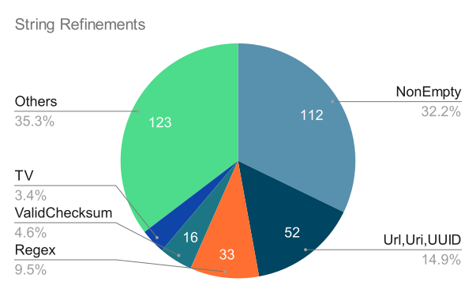

# Design Notes: Refinement Types for Kotlin

* **Type**: Design Notes
* **Author**: Mikhail Vorobev
* **Contributors**: Marat Akhin, Daniil Berezun
* **Discussion**: [#455](https://github.com/Kotlin/KEEP/discussions/455)
* **Issue**: [KT-51417](https://youtrack.jetbrains.com/issue/KT-51417/Restricted-types)
* **Prototypes**: K2 Compiler Plugin for Refinement Classes, K2 Compiler Branch for Refinement Subtypes

# Abstract

This document summarizes research on [refinement types](https://en.wikipedia.org/wiki/Refinement_type),
a feature that aims to enhance safety by allowing developers to specify more precise constraints on values.

We discuss two possible models of refinement types for Kotlin:
* [Refinement Classes](#refinement-classes), an extension for Kotlin inline values classes
* [Refinement Subtypes](#refinement-subtypes), a new Kotlin language feature

# Disclaimer

As a result of discussions on the research presented in this document,
it was decided to shelve the idea of refinement types for Kotlin.
At the moment of writing, features described here are **not** expected to appear in Kotlin
due to low demand and limited usability.
Refer to [Final Decision](#final-decision) for more details.

# Table of Contents

<!-- TOC -->
* [Design Notes: Refinement Types for Kotlin](#design-notes-refinement-types-for-kotlin)
* [Abstract](#abstract)
* [Disclaimer](#disclaimer)
* [Table of Contents](#table-of-contents)
* [Introduction](#introduction)
  * [Refinement Types](#refinement-types)
  * [Motivational Example](#motivational-example)
  * [Supporting Refinement Types](#supporting-refinement-types)
* [Refinement Classes](#refinement-classes)
    * [Predicate Expressions](#predicate-expressions)
    * [Refining a Value](#refining-a-value)
    * [Refinements with Mutable Underlying Values](#refinements-with-mutable-underlying-values)
    * [Operations](#operations)
  * [Challenges](#challenges)
    * [Refining Operations](#refining-operations)
    * [Integration with Smartcasts](#integration-with-smartcasts)
    * [Subtyping of Refinements](#subtyping-of-refinements)
    * [Parametrized Refinements](#parametrized-refinements)
    * [Dependent Refinements](#dependent-refinements)
  * [Rationale](#rationale)
* [Refinement Subtypes](#refinement-subtypes)
    * [Refining a Value](#refining-a-value-1)
    * [Operations](#operations-1)
    * [Integration with Smartcasts](#integration-with-smartcasts-1)
    * [Refinement Subtypes as Typetags](#refinement-subtypes-as-typetags)
  * [Challenges](#challenges-1)
    * [Refining Operations](#refining-operations-1)
    * [Implicit Refining of a Value](#implicit-refining-of-a-value)
    * [Subtyping of Refinements](#subtyping-of-refinements-1)
    * [Propagating Refinement Information](#propagating-refinement-information)
* [Refinement Classes vs Subtypes](#refinement-classes-vs-subtypes)
* [Implementation Notes](#implementation-notes)
* [Final Decision](#final-decision)
  * [Limited Use Cases and Demand](#limited-use-cases-and-demand)
  * [Usability Issues](#usability-issues)
* [Related work](#related-work)
  * [Arrow analysis](#arrow-analysis)
  * [Liquid Haskell](#liquid-haskell)
  * [Scala Refined Library](#scala-refined-library)
  * [Ada Language](#ada-language)
  * [Comparison](#comparison)
  * [Survey](#survey)
    * [Scala Refined and Iron Libraries](#scala-refined-and-iron-libraries)
      * [Provided Refinements](#provided-refinements)
      * [Usage](#usage)
    * [Liquid Haskell Usage](#liquid-haskell-usage)
    * [Ada Usage](#ada-usage)
    * [Conclusion](#conclusion)
<!-- TOC -->

# Introduction

## Refinement Types

A refinement type $RT(T, p)$ is a type that narrows values of type $T$ to those that satisfy
the predicate $p$. In other words, values of type $RT(T, p)$ are those and only those values $v$ of type $T$
for which $p(v)$ is $true$. For example, we can define a type of positive integers as 
$Pos = RT(Int, v \rightarrow v > 0)$.

Refinement types are well suited for expressing pre- and post-conditions for functions
by encoding constraints into the types of arguments and return values.
They also prove useful for maintaining data constraints and invariants when modeling domain objects.

Note that for a value to be of a refinement type is a semantic property and thus might
depend on the context of an execution. For example, if we have `val v: Int`, then in the 
body of `if (v > 0) { ... }` it can be considered to have type $Pos$.

In theory, the predicate of a refinement type could be arbitrarily complex and depend on the context of a refinement type definition. 
However, this document focuses primarily on simple predicates that depend only on the value being refined.

## Motivational Example

Suppose we have a function that makes an API call:

```kotlin
suspend fun getBrokerMessages(
    tag: String,
    batchSize: Int,
    offset: Int,
): MessageBatch 
```

There are probably some pre-conditions on parameters. For example, `tag` cannot be empty,
`batchSize` should be positive, and `offset` should be non-negative. Sending invalid data to a remote 
server will most probably result in an error response, so it is reasonable to validate parameters locally:

```kotlin
suspend fun getBrokerMessages(
    tag: String,
    batchSize: Int,
    offset: Int,
): MessageBatch {
    require(tag.isNotEmpty()) { "Invalid empty tag" }
    // Same for other parameters
}
```

We can approach this from another side by constraining parameter types:

```kotlin
value class Tag(val value: String) {
    init { require(value.isNotEmpty()) }
}

value class BatchSize(val value: Int) {
    init { require(value > 0) }
}

value class Offset(val value: Int) {
    init { require(value >= 0) }
}

// ...

suspend fun getBrokerMessages(
    tag: Tag,
    batchSize: BatchSize,
    offset: Offset,
): MessageBatch
```

This gives us a few benefits. Firstly, now it is impossible to accidentally confuse `batchSize`
and `offset` on the call site as they have distinct types. But more importantly, pre-conditions for parameters of the function are expressed 
directly in the signature of the function, instead of, for example, some combination of documentation 
and checks inside the function.

Also, now the user is forced to perform validation on the call site by constructing a value 
of the required type. However, if a lot of values are given semantic constraints like this,
it will soon become as easy to overlook potential violations of contracts as previously without
this change. 

## Supporting Refinement Types

Note that introducing new types in this way has two important properties:
* Constraints for their values have a uniform expression pattern using `require` calls within `init` blocks
* Constructor calls serve as explicit markers for constraint validation points where a value is "refined"

Those properties make it quite possible to support those types
by analyzing the satisfiability of their constraints statically.
By doing this, we aim to achieve the following goals:
* Improve safety without compromising user experience. 
  We can issue warnings for potential constraint violations 
  while avoiding unnecessary alerts in cases where constraint satisfaction can be statically determined
* Move safety guarantees from the runtime to the compile-time. 
  We can even eliminate runtime checks where constraint validity is proved for a value statically

The following usage of the function from [Motivational Example](#motivational-example) showcases the desired result:

```kotlin
val tag: Tag = ...
val batchSize: BatchSize = ...
var offset: Offset = ...
repeat(42) {
    val batch = getBrokerMessages(tag, batchSize, offset)
    // process batch
    // offest.value >= 0 and batchSize.value > 0
    //     ==> offset.value + batchSize.value >= 0
    //     ==> Offset constructor call is always correct
    offset = Offset(offset.value + batchSize.value)
}
```

In this code snippet constructor argument of the `Offset` class is checked each iteration.
But through static analysis it might be possible to verify that the constraint (`value >= 0`) is always satisfied. 
The compiler can possibly erase it, thus maintaining semantic correctness of a value between calls.

# Refinement Classes

We can directly "codify" the idea proposed in [Supporting Refinement Types](#supporting-refinement-types)
and use inline value types as the basis for refinement types.
When marked with `@Refinement` annotation, such classes are called *refinement classes*. 
Their single value parameter is called *underlying value*, and its type is called *underlying type*.

Refinement classes can express the predicate of the refinement in terms of `require` call (or multiple calls) inside their `init` block.
The argument of the `require` call is denoted as *predicate expression*. Predicate expression should have type `Boolean`
and depend only on the underlying value.

Example definition of a refinement class:

```kotlin
@Refinement
@JvmInline
value class PosInt(val value: Int) {
    init { require(value > 0) }
}
```

### Predicate Expressions

A set of predicate expressions supported with static analysis depends on the underlying type. 
One underlying type could also potentially have different types of possible refinements which cannot be used together. 
For example, only comparisons with constants and logical conjunction of them could
be allowed for underlying type `Int`, yielding refinements that correspond to integer intervals.

The compiler should warn the user when it encounters an unsupported predicate expression.
The `Refinement` annotation then should have no further effect in this case.

### Refining a Value

A value is refined by calling a refinement class constructor. So each call to the primary constructor of the
refinement class should be analyzed statically to determine if the predicate holds for the constructor argument. There are
three possible outcomes of such analysis:
* The analysis deduces that the predicate holds. If the analysis is sound, the compiler might erase the runtime check of the predicate
* The analysis cannot determine whether the predicate holds or not. Then the compiler should leave the runtime check in place. The compiler might issue a compilation warning to notify the user of a possible bug
* The analysis deduces that the predicate does not hold. Then the compiler should issue a compilation error

The analysis is not expected to be interprocedural, but it should account for the context of a constructor call
to support explicit constraint checks by the user and possibly more complicated cases.

For example,
in the following code it should deduce that the constraint is satisfied and the constructor call is safe:

```kotlin
val v1 = readLine().toInt()!!
var v2 = readLine().toInt()!!
if (v1 > 0) {
    while (v2 < 0) {
        val pos = Pos(v1 - v2)
        // ...
    }
}
```

### Refinements with Mutable Underlying Values

Note that mutable underlying values pose a challenge for the described functionality.
Mutability allows a value to stop satisfying the refinement predicate at some point, 
and this can be hard (or impossible) to track. 

For example, one might try to introduce `NonEmptyList` like so:

```kotlin
@Refinement
@JvmInline
value class NonEmptyList<T>(val value: List<T>) {
    init { require(value.isNotEmpty()) }
}
```

But usage of this refinement class could lead to errors:

```kotlin
val list = mutableListOf(42)
val nel = NonEmptyList(list)
emptyListSomewhereDeepInside(list)
// Here nel.value is empty
```

Thus, usage of non-deeply-immutable types for underlying values should be prohibited.

Possible ways to support mutable values are:
* Somehow limit predicate expressions to those which depend only on immutable parts of the underlying value
* Allow mutable underlying values but perform runtime predicate checks periodically 
  instead of just on a constructor call. 
  For example, it can be done everytime a refinement class instance is passed to or returned from a function
  (this is what Ada does, see [Ada Language](#ada-language))

### Operations

Refinement classes allow introducing new operations
by declaring methods or extensions for them.
For example:

```kotlin
@Refinement
@JvmInline
value class MultipleOf4(val value: Int) {
    init { require(value % 4 == 0) }
  
    fun exactlyHalf(): Int = value / 2
}

fun MultipleOf4.exactlyQuarter(): Int = value / 4
```

However, integrating a refinement class with 
existing underlying type operations poses challenges for usability.
See [Refinement Classes -> Challenges -> Refining Operations](#refining-operations) for details.

## Challenges

This section presents properties of refinement types, including integrations with other language features,
which are desirable but challenging to achieve with the refinement classes design.
For each property, we discuss the obstacles to introducing it and evaluate possible solutions.
The properties are listed with the most practical and realistic ones coming first.

### Refining Operations

Refinement classes do not inherit operations of the underlying type directly.
So there are two possibilities to use them:
* Unpack the underlying value of a refinement class
* Redefine an operation from the underlying type with a method or an extension

For example:

```kotlin
@Refinement
@JvmInline
value class Pos(val value: Int) {
    init { require(value > 0) }
  
    infix operator fun minus(other: Pos): Int = value - other.value
}

val p1: Pos = ...
val p2: Pos = ...
val r1: Int = p1.value - p2.value
val r2: Int = p1 - p2 // requires redefined method
```

Note that if we choose to redefine a method and also
want to mix refinement classes and underlying types in operations,
we have to introduce additional overloads for the redefined method.
For example:

```kotlin
@Refinement
@JvmInline
value class Pos(val value: Int) {
    init { require(value > 0) }
  
    infix operator fun minus(other: Pos): Int = value - other.value
    infix operator fun minus(other: Int): Int = value - other
}

val p: Pos = ...
val i: Int = ...
val r: Int = p - i
```

However, redefining a method allows us to "refine" it, 
narrowing its signature, and thus preserve a refinement.
For example:

```kotlin
@Refinement
@JvmInline
value class Pos(val value: Int) {
    init { require(value > 0) }
  
    infix operator fun plus(other: Pos): Pos = 
        Pos(value + other.value)
}

val p: Pos = ...
val d: Pos = p + p
```

Note that such methods do not **override** corresponding methods of the underlying type.
In other words, operations in refinement classes are non-polymorphic in relation to underlying type operations
(generally refinement classes can inherit interfaces and have polymorphic methods).
But this does not seem to be a problem
because a refinement type should not change behavior compared to the underlying type.

More importantly, the design forces users to repeat methods of the underlying type to refine them.
Users might have to repeat a significant portion of the underlying type API if it preserves the refinement.
This limitation represents one of the biggest blockers for the introduction of refinement classes.
There seems to be a spectrum of solutions to this problem:
* Do not solve it and force repetition of an API
* Provide some concise way for a user to express what methods should be refined. This could be done in the form of static method signature refinement, without changing the implementation. For example, `Pos` could state that `Int.plus(Int) -> Int` actually has signature `Pos.plus(Pos) -> Pos`
* Somehow automatically deduce which underlying type methods could be refined. This might be achieved to some extent by extending contracts, allowing them to express which properties are preserved by a method

[Refinement Subtypes](#refinement-subtypes) make a different tradeoff regarding operations,
simplifying usage of underlying type methods while making it harder to refine them.
See [Refinement Subtypes -> Challenges -> Refining Operations](#refining-operations-1).

### Integration with Smartcasts

For any non-null type $T$ the following equality can be considered: $T = RT(T?, v \rightarrow v \neq null)$.
Similarly, for `interface I` and `class S : I`, $S = RT(I, v \rightarrow v \text{ is } S)$.

Thus, smartcasts like this could be regarded as a limited refinement type deduction from context:

```kotlin
val v: Int? = ...
if (v == null) return
// here v is Int

val v: Base = ...
if (v !is Derived) return
// here v is Derived
```

However, smartcasts do not change the runtime representation of the value. 
But refinement classes introduce a distinct
class for a refinement type, thus making it incompatible with smartcasts. 
[Refinement Subtypes](#refinement-subtypes) design solves this problem,
see [Refinement Subtypes -> Integration with Smartcasts](#integration-with-smartcasts-1).

### Subtyping of Refinements

Theoretically speaking, it is natural to incorporate refinement types into the subtyping relation in the following way:
$RT(T, p) <: RT(S, q)$ if $T <: S$ and $\forall v \in T: p(v) \Rightarrow q(v)$.
In other words, a refinement type can be considered a subtype of another refinement type when: 
* Their underlying types are in a corresponding subtyping relation
* The first predicate is stricter than or equivalent to the second one

But in practice, this idea does not fit well with refinement classes:
* Checking implication on predicates is a hard task for general refinement domains
* This subtyping rule is more of a structural kind and feels off for Kotlin nominal subtyping
* Inline value classes introduce a separate type and do not allow inheritance,
  so even nominal subtyping is not possible with them

However, explicit conversions between refinement classes mitigate this problem. 
Analysis might verify such conversions, but if it fails, the user takes responsibility.
For example:

```kotlin
@Refinement
@JvmInline
value class NonNeg(val value: Int) {
    init { require(value >= 0) }
}

@Refinement
@JvmInline
value class Pos(val value: Int) {
    init { require(value > 0) }
    
    // If deduced to be correct, runtime check might be eliminated during compilation
    fun toNonNeg(): NonNeg = NonNeg(value)
}
```

### Parametrized Refinements

Unfortunately, refinement classes do not provide the possibility to create general, parametrized refinements.
This can lead to low code reusage and a lot of boilerplate code. 
For example, something similar to the following code is unachievable:

```kotlin
@Refinement
@JvmInline
value class IntInRange<const a : Int, const b : Int>( // pseudo-syntax
    val value: Int
) {
    init { require(value >= a && value <= b) }
}

typealias Pos = IntInRange<1, Integer.MAX_VALUE>
typealias NonNeg = IntInRange<0, Integer.MAX_VALUE>
```

To support this, we need the type system to allow manipulating values at the type level.
We believe there are at least two ways to make it happen:
* Introduce literal types to the type system so they can be used as generic type parameters. 
  Note that they are tricky to support in the presence of JVM type erasure. 
  For example, Scala supports retrieving value from a literal type with `given` instances
  (similar to context parameters in Kotlin) which constraints their usage
* Introduce type operators (constructors) which support value parameters directly. 
  This approach is similar to Liquid Haskell type aliases and Ada generic packages.
  However, this is usually implemented by generic instantiation (like C++ templates),
  which again does not fit well with the JVM type erasure

For more context on technologies mentioned in this section, refer to [Related Work](#related-work).

### Dependent Refinements

After discussing parametrization of refinements by compile-time values, 
we might imagine parametrizing them by runtime values.
In other words, support [dependent types](https://en.wikipedia.org/wiki/Dependent_type), 
only limited to the form of refinement types.

Note that parametrized refinements would allow "linking" together refinements in one definition
by imposing constraints with the same parameter on them.
For example (here `N` is integer known at compile-time):

```kotlin
fun <T, const N : Int> find(list: ListOfSize<T, N>, value: T): IntInRange<-1, N> = ...
```

However, this would be of little use as it is possible to apply this function only
to a list with size known at compile-time. 
Otherwise, we could not "lift" the size to the compile-time level:

```kotlin
val list: List<Int> = ...
find<Int, ???>(list) // no way to apply find
```

But refinement types are already associated with a predicate, 
and we could allow this predicate to depend on values from context as lambdas do. 
For demonstration, it is convenient to adopt notation from [Refinement Subtypes](#refinement-subtypes).
For example:

```kotlin
fun <T> find(list: List<T>, value: T): Int satisfies { -1 <= it && it < list.size() } {
    var index: Int = -1
    // find the value
    return index // how to re-establish the refinement?
}
```

But in the presence of possibly mutable values (`list` in the example above),
semantics of refinement types that depend on them is not obvious.
As soon as a value changes, refinement predicates depending on it change too, 
and refined values might not satisfy them any longer.
Such invalidations of refinements are practically impossible to track,
so it seems that the only option is to give them a "snapshotting" semantics.
In other words, refinement predicates fix the state 
of context values they depend on at some well-defined point.
So in the example above, mention of `list.size()` might refer
to the size of the list at the moment of calling the function,
later mutations of `list` do not change the return value refinement.

But in this case, it is still unclear what notation to use for return value if explicit refining is adopted.
If the return type is repeated – `return index as Int satisfies { -1 <= it && it < list.size() }` – it might denote 
another refinement because `list.size()` might be changed during execution of the body.

Also, if such an anonymous refinement definition does not actually capture `list` 
and only use its value fixed at some point for static analysis and runtime check of the return value,
implementation is still unclear.
Again, `list` might change during execution of the body, 
so the compiler might be required to evaluate and store the result of `list.size()` on entering the function.

This functionality is similar to pre- and post-conditions of Ada (see [Related Work](#ada-language)).

## Rationale

Refinement classes are a combination of inline value classes
and static refinement predicate verification.
They are an enhancement for what already could be expressed.

Inline value classes serve as a base for refinement classes:
* They provide a way to model refinement types without introducing any special syntax or logic.
  Refinement predicate checks are executed at runtime following standard semantics of `init` block
* They impose the restriction of a single value parameter that fits well with refinement types semantics
* They might be represented in runtime as just the underlying value in some cases when compiler optimization is applicable

In turn, refinement predicates satisfiability analysis
provides additional support for refinement classes:
* It offers safety to users by providing diagnostics on possible constraints violations
* It partially moves predicate verification from runtime to compilation

Refinement classes might be useful as a model for refinement types in some cases,
but an examination surfaces considerable downsides of the design, mainly:
* No compatibility with the underlying type
* Usage of underlying type methods is cumbersome, see [Refinement Classes -> Challenges -> Refining Operations](#refining-operations)
* No integration with smartcasts, see [Refinement Classes -> Challenges -> Integration with Smartcasts](#integration-with-smartcasts)
* No subtyping relation between refinement classes, see [Refinement Classes -> Challenges -> Subtyping of Refinements](#subtyping-of-refinements)

An alternative design of [Refinement Subtypes](#refinement-subtypes) is
an attempt to solve the problems of refinement classes.

# Refinement Subtypes

Refinement classes introduce a new type different from the underlying type
(compiler could optimize inline value classes to the underlying type in runtime, but it is not guaranteed). 
We can consider a different approach where a refinement type is a subtype of the underlying type 
and has the same runtime representation.
For comparison purposes, we will denote refinement types expressed in this alternative way as *refinement subtypes*.

Defining a refinement subtype requires some new syntax. For example:

```kotlin
// refinement, satisfies are new keywords
refinement <RefinementSubtypeName> = <UnderlyingType> satisfies { <predicate> }
// for example
refinement Pos = Int satisfies { it > 0 }
```

A refinement subtype could be the underlying type of another refinement subtype.
In this case, its runtime representation is obtained by recursively expanding refinement subtypes,
and predicate implicitly includes all the predicates in a chain.
This is similar to how typealises work.
Likewise, cycles in refinement subtypes definitions result in a compilation error.
For example:

```kotlin
refinement Pos = Int satisfies { it > 0 }
refinement EvenPos = Pos satisfies { it % 2 == 0 }
```

Runtime representation of `EvenPos` is `Int` and its predicate is effectively `it > 0 && it % 2 == 0`.

We keep [all the restrictions](#predicate-expressions) on the supported underlying types and 
refinement predicates from the refinement classes design.
However, refinement classes rely on pre-existing language features
and thus work correctly even with refinements unsupported by a static analysis.
On the other hand, introducing refinement subtypes forces us to answer questions like:
* How can one get and use a value of such a type?
* What is the "meaning" of using such types, for example, with type operators (`as`, `is`, etc.)?

In other words, we have to introduce semantics for refinement subtypes:
* Type operations with refinement subtypes should check predicates.
  So `x is <RefinementSubtypeName>` is equivalent to `x is <UnderlyingType> && <predicate>(x)`.
  Thus, `as` and `as?` become a way to explicitly refine a value,
  just like calling a constructor of a refinement class.
  Check might be not inserted if it was statically deduced that the predicate always holds for a refined value
* Refinement subtype is a subtype of the underlying type and inherits its member scope. 
  Thus, all the operations of the underlying type are accessible for the refinement subtype.
  For example, for `v: Pos` expression `v + v` resolves to `Int.plus` and yields an `Int`.
  See [Refinement Subtypes -> Challenges -> Refining Operations](#refining-operations-1) for a discussion 
  on the problem of "refining" inherited operations
* Refinement subtypes should be erased to corresponding underlying types in the runtime.
  This makes them more of a compile-time construct than refinement classes,
  avoiding unnecessary runtime performance penalties

Regarding predicate checking semantics for type operators,
it is important to note that checks are not performed 
if a refinement subtype is used as a generic parameter.
For example, expression `listOf(1, 2, 3) as List<Pos>` is an unchecked cast
just as `listOf(1, 2, 3) as List<String>` is.
How obscure a runtime error would be if such a cast is misused
depends on an implementation of refinement subtypes.

### Refining a Value

Described type operators semantics correspond to the
intent of checking that the value operand belongs to a refinement subtype.
So, as already mentioned, it allows refining a value with `as` and `as?` operators.
For example:

```kotlin
fun usePos(p: Pos): Int = ...

val v: Int = ...
usePos(v as Pos)
```

If a value does not satisfy the predicate, `as` operator should throw an exception.
So, for example, `val p: Pos = v as Pos` is roughly equivalent to:

```kotlin
val p: Pos = if (v > 0) {
    // here v is unconditionally downcasted to `Pos`
    v
} else {
    throw TypeCastException(...)
}
```

Here it is important that a refinement subtype shares runtime representation with the underlying type.
Similar behavior would make little sense with refinement classes,
because `as` would be used with the refinement class type which is unrelated to the underlying type.

Also, type operators become the places where we apply static refinement predicate verification
to support refinement types in the compile-time.
Conceptually, this analysis is equivalent to [the one of refinement classes constructor calls](#refining-a-value)
and has three possible outcomes:
* Refinement predicate always holds for the value operand, 
  and a runtime check of the predicate might be omitted
* The analysis failed to determine satisfiability with certainty, 
  and we have to fall back to a runtime check,
  also possibly emitting a warning
* The value could not possibly satisfy the refinement predicate,
  so a compilation error should be raised

For example:

```kotlin
fun usePos(p: Pos): Int = ...

val v: Int = ...
if (v > 0) {
    // Predicate always holds due to the explicit `v > 0` check
    // The analysis should deduce that and the compiler might omit a runtime check
    usePos(v as Pos)
} 
```

We can also consider implicit refining of a value, see [Implicit Refining of a Value](#implicit-refining-of-a-value).

### Operations

Refinement subtypes are much more convenient for the user than refinement subclasses
as they inherit member scope from the underlying type.
But as they share runtime representation with the underlying type,
they could only support static resolution.
In other words, polymorphic methods with runtime dispatch are infeasible for refinement subtypes.
This is reflected in their design:
declaration of a refinement subtype does not allow members,
only extensions can be used to define new operations.
For example:

```kotlin
refinement Even = Int satisfies { it % 2 == 0 }

fun Even.exactlyHalf(): Int = this / 2
```

However, this situation makes refining underlying type operations challenging,
see [Refinement Subtypes -> Challenges -> Refining Operations](#refining-operations-1) for more information.

### Integration with Smartcasts

Note that semantics for `is` check integrates refinement subtypes
with the path-dependent type narrowing in Kotlin.
In other words, stable values can be smartcasted to a refinement subtype.
For example:

```kotlin
fun usePos(p: Pos): Int = ...

val v: Int = ...
if (v is Pos) { // In the compiled code this is `v is Int && v > 0`
    usePos(v)
}
```

Again, it is crucial that refinement subtypes are erased to the underlying type in runtime.
This allows smartcasts to perform "ephemeral" downcasting which exists only at compile time.

### Refinement Subtypes as Typetags

Note that refinement subtypes with an empty predicate (constant `true`) 
still behave like proper subtypes of the underlying type.
In other words, while they have exactly the same set of values as the underlying type does,
explicit conversion from the underlying type is still required.
This might be useful for domain modeling to effectively define opaque typealiases
which do not allow confusion with the underlying type.
For example:

```kotlin
refinement MessageId = Int satisfies { true }

fun getMessage(id: MessageId) { ... }

val v: Int = ...
// Compilation error, MessageId expected, got Int
// getMessage(v) 
getMessage(v as MessageId) // OK
```

This would satisfy user request for `typetag` (see [KT-75066](https://youtrack.jetbrains.com/issue/KT-75066/Feature-Request-typetag-Keyword-for-Compile-Time-Type-Safety)).

## Challenges

The main reason for exploring the refinement subtypes design,
where refinement types are a distinct language feature,
was usability challenges of [Refinement Classes](#refinement-classes), for example,
[Refining Operations](#refining-operations), [Integration with Smartcasts](#integration-with-smartcasts) and 
[Subtyping of Refinements](#subtyping-of-refinements).
Refinement subtypes [make a different tradeoff regarding operations](#refining-operations-1),
[solve the problem of integration with smartcasts](#integration-with-smartcasts-1) and 
[enhance subtyping of refinements with a support for nominal subtyping](#subtyping-of-refinements-1).
However, the design is still not perfect and there are challenges to be discussed.
We do it in this section prioritizing the most practical problems.

### Refining Operations

Refinement subtypes cannot support polymorphic methods with runtime dispatch 
due to sharing runtime representation with their underlying type, 
leaving them with extensions only.
Those constraints correspond to the intuition
that a refinement type should not override the behavior of the underlying type.
However, unfortunately, they make refining underlying type operations impossible
because extensions have lower priority during resolution
than methods inherited from the underlying type.
For example:

```kotlin
infix operator fun Pos.plus(other: Pos): Pos = 
    ((this as Int) + other) as Pos

val p: Pos = ...
val d: Int = p + p // Resolved to Int.plus
```

Note that refinement class methods are effectively non-polymorphic too,
but their design allows declaring their own methods
and thus refining methods from the underlying type by "redefining" them.
For example:

```kotlin
@Refinement
value class Pos(val value: Int) {
   init { require(value > 0) }

   // This method does not override Int.plus
   // and cannot be overridden, 
   // so it is effectively non-polymorphic
   infix operator fun plus(other: Pos): Pos = 
      Pos(this.value + other.value)
}

val p: Pos = ...
val d: Pos = p + p
```

It is possible to "refine" methods of the underlying type by defining an extension with a different name.
For example:

```kotlin
fun Pos.plusPos(other: Pos): Pos = 
    ((this as Int) + other) as Pos

val p: Pos = ...
val d: Pos = p.plusPos(p)
```

But using such extensions is substantially less convenient than redefined methods of refinement classes.
To solve this problem, we could:
* Allow declaring special static-resolution-only methods for refinement subtypes
* Make extensions take precedence over inherited members for them

But a more important issue would still persist: 
the necessity to repeat large API parts if they preserve the refinement.
Possible solutions to it are roughly the same as for refinement classes:
* Allow users to declaratively specify which methods should preserve refinement through static signature refinement. For example, `Pos` could declare that `Int.plus(Int) -> Int` should be treated as `Pos.plus(Pos) -> Pos` without modifying the implementation
* Develop automatic detection of refinement-preserving methods, possibly by enabling the contract system to express which properties are maintained by operations

Arguably, this problem is one of the biggest blockers for the introduction of refinement types,
either with refinement classes or refinement subtypes.

### Implicit Refining of a Value

As refinement subtypes share runtime representation with the underlying type,
we can allow implicit refining of a value with them.
In this case, values of the underlying type are accepted for the refinement subtype,
and a runtime check for the predicate is inserted automatically.
For example:

```kotlin
refinement Pos = Int satisfies { it > 0 }

fun usePos(p: Pos) = ...

val v: Int = ...
usePos(v) // OK
// transformed to:
// usePos(if (v > 0) v else throw ...)
```

We can also extend those semantics to refinement subtypes
which have compatible underlying types.
For example:

```kotlin
open class Base(open val prop: Int)
class Derived(arg: Int): Base(arg + 42)

refinement PosBase = Base satisfies { it.prop > 0 }
refinement EvenDerived = Derived satisfies { it.prop % 2 == 0 }

fun usePosBase(pb: PosBase) = ...

val ed: EvenDerived = ...
usePosBase(ed) // OK
// transformed to:
// usePosBase(if (ed.prop > 0) ed else throw ...)
```

The choice whether refining a value should be explicit or implicit
might be even left to the user by introducing different syntax for two cases
(similar to [Ada Language](#ada-language)).
For example:

```kotlin
subtype PosImplicit = Int satisfies { it > 0 }
newtype PosExplicit = Int satisfies { it > 0 }

val v: Int = ...
val pos: PosImplicit = v // OK
val pos: PosExplicit = v // FAIL
val pos: PosExplicit = v as PosExplicit // OK
```

For the case of implicit refining, usages of underlying type values
(or of some other refinement subtype values with the same underlying type) 
as values of the refinement subtype should be analyzed statically.
Depending on the results of the analysis, runtime checks might be omitted.
In a sense, this analysis is the same as for refinement subtypes with explicit refining and refinement classes.
For example:

```kotlin
fun usePos(p: PosImplicit): Int = ...

val v: Int = ...
if (v > 0) {
    usePos(v) // predicate is satisfied, runtime check might be omitted
} 
```

The problem with implicit refining is that it makes code rather hard to manage. 
Subtle code change might make static analysis fail and suddenly
introduce a runtime check where there was none, and it is not represented in the code. 
For example, suppose the compiler has deduced that a runtime check is not needed in the following code:

```kotlin
fun usePos(p: PosImplicit) = ...

var i = 0
while (i < 42) {
    usePos(i) // runtime check is omitted
    // a lot of code
    i += 1
}
```

But after an innocently looking code change, the analysis fails, and a runtime check needs to be inserted:

```kotlin
var i = 0
while (i < 42) {
    usePos(i) // runtime check inserted 
    // a lot of code
    i = complicatedIndexCalculation(i)
}
```

This is a situation dual to the explicit refining.
Operator `as` with a refinement subtype or a refinement class constructor call indicate a possibility
of a runtime check, no matter the result of an analysis:

```kotlin
refinement Pos = Int satisfies { it > 0 }
// or
@Refinement
value class Pos(val value: Int) {
    init { require(value > 0) }
}

fun usePos(p: Pos) = ...

var i = 0
while (i < 42) {
    // runtime check possibility
    // is explicit in the code
    usePos(i as Pos)
    // or
    usePos(Pos(i))
    // a lot of code
    i = complicatedIndexCalculation(i)
}
```

Also, refining a function parameter type might introduce runtime checks on all callsites if refining is implicit.

### Subtyping of Refinements

In contrast to refinement classes, refinement subtypes introduce nominal subtyping for refinements.
This means that a user can establish subtyping relations between refinements by
declaring one refinement subtype as the underlying type of another.
For example, `EvenPos` is a subtype of `Pos`:

```kotlin
refinement Pos = Int satisfies { it > 0 }
refinement EvenPos = Pos satisfies { it % 2 == 0 }

fun usePos(p: Pos) = ...

val ep: EvenPos = ...
usePos(ep) // OK
```

But they still do not provide structural subtyping which relates
refinement types with compatible underlying types 
based on "strictness" of their predicates (see [Subtyping of Refinements](#subtyping-of-refinements)).
For example, `Pos` is not considered to be a subtype of `NonNeg` in the following code:

```kotlin
refinement Pos = Int satisfies { it > 0 }
refinement NonNeg = Int satisfies { it >= 0 }

fun useNonNeg(n: NonNeg) = ...

val p: Pos = 42 as Pos
// `p > 0` implies `p >= 0`
useNonNeg(p) // but this is prohibited
```

In the case of [implicit refining](#implicit-refining-of-a-value) and only nominal subtyping, 
we can make all refinement subtypes with compatible underlying types
implicitly compatible (with runtime checks inserted), 
so they would act somewhat as subtypes of each other.

If we stick to the explicit refining,
we have to require explicit conversions between unrelated refinements
just as for refining a value of the underlying type.
So in this case broader support for structural subtyping of refinements
means less explicit conversions and runtime checks are required.
Thus, it is beneficial for safety and convenience.

But independently of the refining explicitness,
the issue of dealing with structural subtyping
still arises at the level of types.
For example, what types should be allowed for `T` in `fun <T : Pos> f(v: T): T`?
If we are to allow structural subtyping for refinement types,
being a subtype of `Pos` is being at-least-as-strong refinement,
it means that to type check an application of `f` typesystem has to be 
able to reason about refinement predicate implications.
It might be practically decidable for some domains, 
but others would require an advanced implementation.
Possible approaches to a solution are:
* Stick with nominal subtyping exclusively for refinement subtypes
* Support structural subtyping to a limited extent,
  relying on predicate implication deduction capabilities of an implementation,
  effectively integrating it into the type system
* Implement complete deduction of structural subtyping relation
  for refinement subtypes.
  This is possible, but would probably come with a tradeoff for compilation performance

We could also consider allowing users to define subtyping relations 
for refinement subtypes in a declarative manner.
For example, in imaginary syntax:

```kotlin
refinement Pos = Int satisfies { it > 0 }
refinement NonNeg = Int satisfies { it >= 0 }

// "treat Pos as a subtype of NonNeg"
// here compatibility of underlying types should be checked
subtype Pos : NonNeg
        
fun use<T : NonNeg>(n: T) = ...

val p: Pos = 42 as Pos
use<Pos>(p) // Now this works
```

This is similar to what [Scala Refined Library](#scala-refined-library) does.

### Propagating Refinement Information

Information about the predicate of a refinement subtype is not shared with other code in any way.
So, despite the compiler checking the predicate, a user has to remember what the guarantees of a refinement are
while using it outside its API.
For example, something like this does not work:

```kotlin
data class Data(val x: Int?)
refinement DataWithX = Data satisfies { it.x != null }

val d: Data = ...
if (d is DataWithX) {
    // DataWithX has `x != null` and thus `d.x` is certainly an Int
    val v: Int = d.x // But this produces an error, because `d.x` has type `Int?`
}
```

One plausible solution is to advance contracts and allow using them in refinement predicates.
For example:

```kotlin
refinement DataWithX = Data satisfies {
    contract { returns(true) implies (it.x != null) }
    it.x != null
}
```

Such functionality is desired by users coming from TypeScript (see [KT-78609](https://youtrack.jetbrains.com/issue/KT-78609))
where facilities exist for defining new types by refining fields of existing types:

```typescript
type Data = { x: number | null }
type DataWithX = Data & { x: number }
```

# Refinement Classes vs Subtypes

A brief comparison of the two discussed models for refinement types:

| Property                                       | Refinement Classes                 | Refinement Subtypes       |
|------------------------------------------------|------------------------------------|---------------------------|
| Compatibility with the Underlying Type         | ❌ Unpacking                        | ✅ Implicit                |
| Subtyping of Refinements                       | ❌ None (Conversions)               | :warning: Nominal         |
| New Operations                                 | ✅ Methods, Extensions              | :warning: Extensions Only |
| Inheriting Operations from the Underlying Type | ❌ No                               | ✅ Yes                     |
| Refining Operations from the Underlying Type   | :warning: Possible by Redefinition | ❌ Impossible              |
| Smartcasts                                     | ❌ None                             | ✅ Supported               |
| Runtime Performance Cost                       | :warning: Possible Boxing          | ✅ None (Erased)           |
| Implementation                                 | ✅ Existing Features                | ❌ New Language Feature    |

To sum up,
refinement subtypes offer a more seamless developer experience
compared to refinement classes by providing implicit compatibility with underlying types,
automatic inheritance of operations, and built-in smartcast support,
essentially making them behave like true subtypes.
However, they are compile-time constructs,
so only static call resolution via extensions is available for them,
making it impossible to "refine" operations of the underlying type.
Refinement subtypes also come at the expense of introducing a new language feature.

# Implementation Notes

[Refinement Classes](#refinement-classes) are based on existing Kotlin features,
while [Refinement Subtypes](#refinement-subtypes) are a new feature which requires considerable changes to the language.
But the choice between those two designs happens to be practically orthogonal to
implementation of static predicate verification for refinement types.
Both designs allow us to analyze the predicate satisfiability for a refined value in compile time
to provide additional support for a user and
possibly eliminate (or do not insert) a runtime predicate check.

In this section we discuss possible implementations of the analysis,
ignoring other details of supporting refinement types.
There are different ways to do it:
* Do not implement the analysis and rely on runtime predicate checks exclusively for refinement types.
  This is what [Ada](#ada-language) and [Scala Libraries](#scala-refined-and-iron-libraries) do,
  see [Related Work](#related-work)
* Implement complete static refinement predicate verification.
  In this case runtime checks are redundant, thus refinement types can be a compile-time construct.
  This is what [Liquid Haskell](#liquid-haskell) does,
  see [Related Work](#related-work)
* Do a partial static refinement predicate verification
  resorting to runtime checks only in case the analysis fails to prove satisfiability in compile-time

While the first approach provides no compile-time support,
it is still useful for contract-based programming and debugging.

On the other hand, complete static verification usually requires an SMT-solver.
Using it comes with the following disadvantages:
* Computational overhead from SMT solvers can result in long compilation times
* Refinement predicates should be limited to a sublanguage which an SMT-solver can process
* Special handling for loops is required because SMT-solvers do not support them directly

The middle-ground approach is an attempt to provide compile-time support for refinement types
without sacrificing practical usability and compilation times.
Particularly, an intraprocedural control- and data-flow analysis can be used for this.
It is sound, can handle loops automatically, has predictable performance, but is not complete.
We believe this solution to be the most suitable for implementing refinement types in Kotlin.

Also, it is important to note that we can integrate CDFA with 
a limited application of an SMT solver.
For example, the latter can be used to reason only about refinement predicates, 
which are usually simple enough for a solver to have predictable performance.
This would allow us to mitigate the problem of subtyping for refinements,
see [Refinement Classes -> Challenges -> Subtyping of Refinements](#subtyping-of-refinements)
and [Refinement Subtypes -> Challenges -> Subtyping of Refinements](#subtyping-of-refinements-1).

As a proof of concept, we implemented both refinement classes and refinement types,
as well as classic integer interval analysis to support interval refinements for integers.
To illustrate, below are examples of what it is capable of:

```kotlin
@JvmInline
@Refinement
value class Positive(val value: Int) {
    init { require(0 < value) }
}

@JvmInline
@Refinement
value class From0To128(val value: Int) {
    init { require(value >= 0 && value <= 128) }
}
```

```kotlin
val v = readLine()?.toInt()!!

if (v > 80) {
    when {
        v < 100 -> {
            // Constructor call is deduced to be correct
            val t = From0To128(v)
        }
    }
}

while (v < 0) {
    // Constructor call is deduced to be incorrect
    val t = From0To128(v)
}
```

```kotlin
val v1 = readLine()?.toInt()!!
val v2 = readLine()?.toInt()!!
val v3 = -42

if (v1 > 100 && v2 > 0) {
    // Constructor call is deduced to be correct
    // Expression is abstractly evaluated
    val t = Positive(v1 * v2 - v3 + v2)
}
```

```kotlin
val v1 = readLine()?.toInt()!!
var v2 = 42
if (v1 > 0) {
    v2 = v1
}
// Constructor call is deduced to be correct
// v2 is mutable, but it is positive in any execution path
val t = Positive(v2)
```

```kotlin
var v1 = readLine()?.toInt()!!
var v2 = 0
while (v1 > 1 && v1 < 100) {
    v1 = v1 * 2
    v2 = v2 + 1
    // Constructor call is deduced to be correct
    // Interval for v2 is approximated with widening
    val t = Positive(v2)
}
```

# Final Decision

After discussion, we decided to postpone the introduction of refinement types for Kotlin indefinitely.
This decision is based on an analysis of both potential benefits 
and design challenges that would compromise the feature's practical utility.
The sections below reiterate the most important arguments against implementing refinement types.

## Limited Use Cases and Demand

Practical use cases for refinement types are few,
as our [Survey](#survey) on their usage in open-source codebases concluded.
This situation undermines the benefits of introducing refinement types,
because we can apply classic modeling approaches to cover users' demands.
For example, one of the most popular refinements for `String` is being a URL,
but introducing a `class URL` with an appropriate API covers the use case decently well,
judging by how many languages and libraries take this approach.

## Usability Issues

The usability of possible implementations for refinement types is questionable,
primarily due to the following challenges:
* Mutable underlying values can violate refinement predicates after initial validation,
  making the type system guarantees unreliable.
  We can address this
  by restricting predicates to those which depend only on immutable properties of the underlying value, 
  performing periodic runtime predicate checks, or prohibiting mutable underlying values completely.
  See [Refinements with Mutable Underlying Values](#refinements-with-mutable-underlying-values) for more context
* It is unclear how to integrate refinement types with existing code.
  Both refinement classes and refinement subtypes require extensive duplication of underlying type APIs 
  to maintain the refinement while using operations which preserve it.
  We could imagine solving the problem by simplifying the process for a user with a declarative refining
  or an automatic deduction of the necessary information.
  Refer to [Refinement Classes -> Challenges -> Refining Operations](#refining-operations) and
  [Refinement Subtypes -> Challenges -> Refining Operations](#refining-operations) for better understanding

However, possible solutions either significantly reduce the feature's utility 
or introduce considerable complexity, making them impractical.

# Related work

## Arrow analysis

[Arrow analysis Kotlin compiler plugin](https://arrow-kt.io/ecosystem/analysis/) also implements static analysis for value constraints
in Kotlin code. Our proposal bears great resemblance to class invariants found in arrow analysis.
However, arrow analysis is based on SMT solvers and thus lacks performance for practical applications.
Also, it is not ported to the K2 compiler at the moment.

## Liquid Haskell

[Liquid Haskell](https://ucsd-progsys.github.io/liquidhaskell/) is arguably the most prominent implementation of refinement types for a general-purpose 
programming language. However, it is based on SMT solvers too. It also requires a lot of annotations
from the user written in a specific sublanguage.

## Scala Refined Library

[Scala refined library](https://github.com/fthomas/refined) is an interesting implementation of refinement types as it does not
require any external tools or even compiler plugins. It heavily relies on the following features of Scala, which are mostly 
unavailable in Kotlin: intersection types, literal types, inductive typeclass instance deduction, powerful macro system.

The library actually supports any (possibly user-defined) representation for refinement types. Out of the box it 
provides representations with intersection types and value classes (similar to those in Kotlin). For example, 
`Int` refined with a lower bound can be expressed as type `Int && Greater[100]` (Here `100` is a literal type, 
argument to generic class `Greater`). Alternatively, the same refinement can be represented as instance of
`Refined[Int, Greater[100]]`, where `Refined` is `final class Refined[T, P] private (val value: T) extends AnyVal`.
Both approaches share the following properties:
* Refinements are lightweight: they exist only on the level of types in compile time. In the runtime only the underlying value is left
* Refined value can be used where value of the underlying type is expected. For intersection types it follows from their semantics. In other cases, implicit conversion is inserted
* Implicit weakening is supported. For example, `Refined[Int, Greater[100]]` can be used in place of `Refined[Int, Greater[0]]` because `Greater[100]` is a strictly stronger refinement than `Greater[0]`. This is achieved through a combination of macros, typeclass deduction, and implicit conversions. User can define inference rules for custom refinements through typeclass instances

Compile-time validation of refinements is supported for constant expressions, but otherwise refining a value always involves
checking refinement predicate in the runtime. Macros and typeclass deduction are known to negatively affect scala compilation time. 
However, this approach is probably still more performant than the use of SMT solvers.

Below is an example of refinement definition:

```scala
// Define the refinement type itself
final case class Greater[N](n: N)

// Define actual refinement predicate by providing a ` Validate ` typeclass instance
implicit def greaterValidate[T, N](implicit
  wn: WitnessAs[N, T], // Require that `N` is subtype of `T`
  nt: Numeric[T] // Require that the type `T` is a numeric type
): Validate.Plain[T, Greater[N]] =
  Validate.fromPredicate(
    t => nt.gt(t, wn.snd), // Actual predicate implementation
    t => s"($t > ${wn.snd})", 
    Greater(wn.fst)
  )

// Define inference rule
implicit def greaterInference[C, A, B](implicit
  wa: WitnessAs[A, C],
  wb: WitnessAs[B, C],
  nc: Numeric[C]
): Greater[A] ==> Greater[B] =
  Inference(
    nc.gt(wa.snd, wb.snd), // Actual implication condition
    s"greaterInference(${wa.snd}, ${wb.snd})"
  )

// Now, to refine a value, we call a function that performs validation in the runtime
// It returns `Left` with the error description in case validation fails
val v: Int = ...
val refinementResult: Either[String, Refined[Int, Greater[100]]] = refineV(v)
val rv: Refined[Int, Greater[100]] = refinementResult.get()
// We can weaken refinement implicitly
val weakened: Refined[Int, Greater[0]] = rv
```

Note also that there is the [iron library](https://github.com/Iltotore/iron) with much similar functionality.
However, it supports scala 3 exclusively and uses its new features. 
Refinement types are represented as opaque type aliases to the underlying type with type bounds:

```scala
/**
 * An Iron type (refined).
 *
 * @tparam A the underlying type.
 * @tparam C the predicate/constraint guarding this type.
 */
opaque type IronType[A, C] <: A = A
```

## Ada Language

[Ada Programming Language](https://ada-lang.io/) is focused on developing reliable and correct software. It provides
a handful of features for contract-driven development. Some of them, namely range types, [subtype predicates](http://ada-auth.org/standards/12rat/html/Rat12-2-5.html) and
[type invariants](http://ada-auth.org/standards/12rat/html/Rat12-2-4.html), are quite similar to refinement types
in the sense that they allow constraining values of types with predicates:
* Range types, as the name suggests, allow constraining value to a specific range
* Subtype predicates are divided into two flavors:
  * Static predicates allow predicates only from a small sublanguage. In return, they get more support from the compiler
  * Dynamic predicates allow any boolean expression as a predicate
* Type invariants also allow any boolean expression

All the predicates are checked in the runtime at specific boundaries, mostly at variable initializations and 
procedure (or function) call and return. Such checks can be disabled completely with a compiler option.

Below are example definitions. Type invariants differ from dynamic subtype predicates mostly in application scope 
(they are intended for private types), so they are not examined here.

```ada
type Int7 is new Integer range 0..127;
  
subtype Positive is Integer
    with Static_Predicate => Positive > 0;

type Even is new Integer
    with Dynamic_Predicate => Even mod 2 = 0; -- mod is not allowed in Static_Predicate
```

Note that despite the name, subtype predicates can be applied not only to subtypes but also to new types.
Difference between `subtype T is Integer` and `type T is new Integer` is that former is a subtype of `Integer` and
can be used as such, while later requires an explicit conversion to `Integer`.

Besides predicates for types, Ada supports [pre- and post-condition](http://ada-auth.org/standards/12rat/html/Rat12-2-3.html) declarations for functions.
The concept is dual in a sense to refinement types as 
they are complementary methods for expressing contracts of functions.
However, pre- and post-conditions allow relating arguments and the return value
with shared constraints more easily.
This is a limited form of [Dependent Refinements](#dependent-refinements).
Pre- and post-conditions are also checked in runtime on function call and return, 
if not disabled by a compiler option.
For example:

```ada
function IntegerSquareRoot(X: Integer) return Integer is (...) -- implementation is omitted
    with Pre => X >= 0,
         Post => IntegerSquareRoot'Result * IntegerSquareRoot'Result <= X and 
                (IntegerSquareRoot'Result + 1) * (IntegerSquareRoot'Result + 1) > X;
```

As you can see, the core language supports described features mostly in the form of optional runtime checks. 
However, static analysis tools exist that take advantage of such specifications to actually prove the correctness of programs.
See [SPARK Language](https://docs.adacore.com/spark2014-docs/html/ug/en/introduction.html) based on Ada.

## Comparison

In this section, we evaluate refinement types implementations discussed in [Related Work](#related-work)
along with our proposed [Refinement Classes](#refinement-classes) and [Refinement Subtypes](#refinement-subtypes)
across parameters that capture the essential trade-offs in their design.
We assess safety guarantees provided and solutions to main design usability challenges we identified in
[Refinement Classes -> Challenges](#challenges) and [Refinement Subtypes -> Challenges](#challenges-1).
We also compare underlying technologies and performance characteristics they have,
see [Implementation Notes](#implementation-notes) for more context.
Below is a table summarizing the comparison:

|                                       |                       Arrow Analysis                       |                             Liquid Haskell                              |                          Scala Refined Library                           |                        Ada Language                         |                             Refinement Classes                             |                            Refinement Subtypes                             |
|:--------------------------------------|:----------------------------------------------------------:|:-----------------------------------------------------------------------:|:------------------------------------------------------------------------:|:-----------------------------------------------------------:|:--------------------------------------------------------------------------:|:--------------------------------------------------------------------------:|
| Supported Predicates                  | Expressions including booleans, numbers, object properties | Expressions including booleans, numbers and lifted functions (measures) |                                Arbitrary                                 |                          Arbitrary                          |          Arbitrary with Static Analysis for Supported Predicates           |          Arbitrary with Static Analysis for Supported Predicates           |
| Insuring Safety                       |                ✅ Complete static deduction                 |                       ✅ Complete static deduction                       |              ❌ Runtime checks (compile-time for constants)               |        ❌ Runtime checks (compile-time for constants)        | :warning: Partial static deduction with possible runtime check elimination | :warning: Partial static deduction with possible runtime check elimination |
| Refining a Value                      |                         ✅ Implicit                         |                               ✅ Implicit                                |                                ❌ Explicit                                |       ✅ Implicit or explicit (controlled by the user)       |                                 ❌ Explicit                                 |                 :warning: Explicit with Smartcasts Support                 |
| Compatibility with Underlying Type    |                         ✅ Implicit                         |                               ✅ Implicit                                |                                ✅ Implicit                                |       ✅ Implicit or explicit (controlled by the user)       |                            ❌ Explicit unpacking                            |                                 ✅ Implicit                                 |
| Refining Underlying Type Operations * |           ✅ Automatic (For Annotated Operations)           |                 ✅ Automatic (For Annotated Operations)                  |             :warning: Manual Redefinition (with Typeclasses)             |                        ❌ Unsupported                        |                       :warning: Manual Redefinition                        |                               ❌ Unsupported                                |
| Refinements Subtyping                 |    ✅ Supported through predicates implication deduction    |          ✅ Supported through predicates implication deduction           | :warning: Limited support through inductive user-defined inference rules | :warning: Only explicit `subtype` definitions are supported |                ❌ Unsupported, explicit conversions required                |                        :warning: Nominal Subtyping                         |
| Parametrized Refinements              |                       ❌ Unsupported                        |                               ✅ Supported                               |                      ✅ Supported with literal types                      |              ✅ Supported with generic packages              |                               ❌ Unsupported                                |                               ❌ Unsupported                                |
| Dependent Refinements                 |   ✅ Supported (in the form of pre- and post-conditions)    |                               ✅ Supported                               |           :warning: Limited support with scala dependent types           |    ✅ Supported (in the form of pre- and post-conditions)    |                               ❌ Unsupported                                |                               ❌ Unsupported                                |
| Underlying Technology                 |                        SMT solvers                         |                               SMT solvers                               |        Scala type system, typeclass instance deduction and macros        |             Ada type system and other features              |                       Control and Dataflow Analysis                        |                       Control and Dataflow Analysis                        |
| Compilation Performance Cost          |                            High                            |                                  High                                   |                                 Moderate                                 |                          Moderate                           |                                  Moderate                                  |                                  Moderate                                  |
| Runtime Performance Cost              |                            Zero                            |                                  Zero                                   |                        Moderate (runtime checks)                         |                  Moderate (runtime checks)                  |          Moderate (for boxing and not eliminated runtime checks)           |                Moderate (for runtime checks, but no boxing)                |

\* Ability to refine an operation and use it the same way as for underlying type is assessed.
   For example, to make `a + b` have type `Pos` if `a` and `b` are `Pos` themselves.
   All designs allow defining new operations for refinement types, 
   and it can be used to "refine" underlying type operations.
   For example, one can declare `fun posAdd(a: Pos, b: Pos): Pos`.

## Survey

This section surveys the usage of refinement type implementations discussed in the [Related Work](#related-work).
It was done with GitHub code search.

### Scala Refined and Iron Libraries

#### Provided Refinements

A brief summary of refinements available out-of-the-box in `refined` and `iron` libraries:
* Characters:
  * Sets: `Upper`, `Lower`, `Digit`, `Letter`
* Numeric:
  * Ranges:	`Interval[L, H]`, `Less[N]`, `Greater[N]`, `Positive`, `Negative`
  * Arithmetic:	`Even`, `Odd`, `Divisible[N]`
* Strings:
  * Format: `IPv4`, `URL`, `UUID`, `XML`, `XPath`
  * Matching: `StartsWith[S]`, `MatchesRegex[R]`, `Trimmed`
* Collections:
  * Structure: `Empty`, `NonEmpty`, `Size[N]`, `MinSize[N]`
  * Contents: `ForAll[P]`, `Exists[P]`, `Contains[E]`

#### Usage

Most of the repositories using scala refinement libraries are some examples or API wrappers.
More than 75% of them contained less than five usages of refinement types.

What types appear as an underlying type most often (`TV` stands for "Type Variable"):


What predicates are used for `String` most often:



What predicates are used for numbers most often:


### Liquid Haskell Usage

Most repositories that use Liquid Haskell serve as examples
or provide proof of properties related to data structures and algorithms.

What types appear as an underlying type most often:


What predicates are used for numbers most often
(note: "comparison" here encompasses complex logical expressions built from elementary comparisons of variables or constants):


What predicates are used for lists and vectors most often (note: "length" here encompasses complex logical expressions built from elementary comparisons of collection length):


### Ada Usage

Most of the repositories using ada refinement features are related to system programming.

What types appear as an underlying type most often:


What predicates are used for integers most often (note: "modulus" here stands for Ada feature which allows creating a custom integer ring modulo some constant):


### Conclusion

This survey reveals low adoption of refinement types, at least in open-source codebases.
It also shows that a very limited number of underlying type and predicate combinations cover most refinement types usages.
This leads to a conclusion that a big part of use cases might be covered with classical modeling approaches 
(e.g., separate classes for `URL`, `NonEmptyList` and so on), there is little demand for general refinement types.