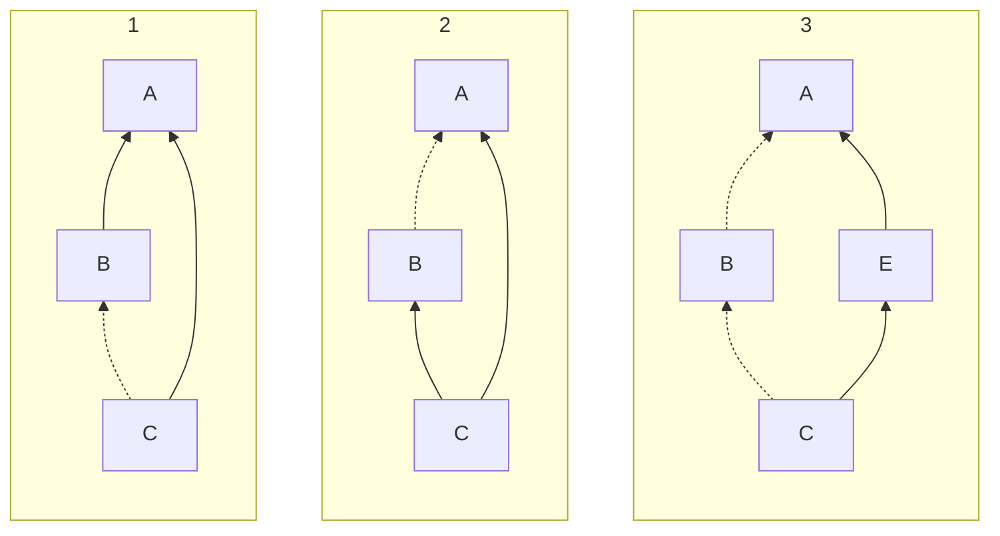

# Shared internals

* **Type**: Design proposal
* **Author**: Alejandro Serrano
* **Contributors**: Yahor Berdnikau, Joffrey Bion, Pavel Kunyavskiy, Alexander Likhachev, Adam Semenenko, Timofey Solonin
* **Discussion**: 
* **Status**: In progress
* **Related YouTrack issues**: 
  [KT-76146](https://youtrack.jetbrains.com/issue/KT-76146/Add-the-ability-to-declare-friend-dependencies), 
  [KT-62688](https://youtrack.jetbrains.com/issue/KT-62688/Provide-a-Kotlin-plugin-DSL-to-configure-friend-modules)

## Abstract

We propose a way for a Kotlin module to share part of its internal declarations
to other modules, using a new `shared internal` visibility.
This design requires only small changes to the language, except for a limitation
on inheritance on mixed shared/non-shared dependency chains.

## Table of contents

* [Abstract](#abstract)
* [Table of contents](#table-of-contents)
* [Motivation](#motivation)
  * [On naming](#on-naming)
  * [Visibility, stability, exhaustiveness](#visibility-stability-exhaustiveness)
* [Design choices](#design-choices)
  * [Transitivity](#transitivity)
* [Proposal](#proposal)
  * [Shared internal declarations](#shared-internal-declarations)
  * [Sharing levels](#sharing-levels)
  * [Module data](#module-data)
  * [Module identifier](#module-identifier)
  * [Language](#language)
  * [Internals and the JVM](#internals-and-the-jvm)
  * [Deprecations](#deprecations)
  * [Tooling](#tooling)
* [Modes of use](#modes-of-use)
* [Alternatives](#alternatives)

## Motivation

[Internal visibility](https://kotlinlang.org/spec/declarations.html#declaration-visibility)
in Kotlin gives access to a declaration (class, function, property) to others in
the same module. A module is already a **tightly coupled** artifact — it is 
even compiled in a single unit — so it makes sense to depend more tightly on 
nuances of the declarations in the same module. 

At the same time, the notion of module in the Kotlin ecosystem has been equated 
with that of a **library** or a **dependency**. For example, in the JVM 
ecosystem internal visibility also means visible within your same JAR.
This creates friction: what is a unit from one perspective (access to internal 
declarations) may end up broken into separate modules because of other
constraints.

**Test modules.**
Depending on the build tool, tests work as the same or as a different module. 
Currently, the Gradle plugin for Kotlin sets everything up so you can access 
internal declarations from tests in the same subproject. However, sometimes it
is useful to separate those tests, and in that case such access
becomes impossible.

**Cohesive set of libraries with minimized dependencies.** 
Having the smallest amount of dependencies is considered important by many 
people in our community. This leads to a common scenario in which a library is 
split between its "core" part, with minimal dependencies, and several other 
modules which require additional dependencies
([kotlinx.coroutines](https://kotlinlang.org/api/kotlinx.coroutines/) is an 
example of such a library). 
On the other hand, all those modules are developed as a unit, so it makes sense 
to allow seeing some of the internals of the core library within the others.

These problems are already faced by Kotlin developers, as witnessed by the 
ability to declare "friend modules" in some platforms, and requests to make them
stable
([#1](https://youtrack.jetbrains.com/issue/KT-76146/Add-the-ability-to-declare-friend-dependencies), 
[#2](https://youtrack.jetbrains.com/issue/KT-62688/Provide-a-Kotlin-plugin-DSL-to-configure-friend-modules)).
The goal of this proposal is to provide a well-defined way to share internal 
declarations, with an eye on working across different platforms and build 
strategies.

### On naming

Since "friend modules" seem like a well-established term in our community, 
a fair question is why choose "shared internals" instead. During the development
of this proposal, it became clear that "friend modules" gives the wrong 
impression of being a symmetric relationship.
That is, intuitively _A is a friend of B_ should imply that _B is a friend of A_
(that's how most friendships work, after all). 
For that reason, through this document we use _A shares its internals with B_ 
instead, or _B sees the internals of A_ for the converse relation.

> [!TIP]
> Throughout this document we use letters A to E for module names,
> and letters `X` to `Z`, `Example`, and pets for classes.

### Visibility, stability, exhaustiveness

Up to this point we have talked about internal visibility as a single concept.
However, there are other places in the language where "being in the same module"
changes the expected behavior, in addition to visibility of a declaration.

[Smart cast sink stability](https://kotlinlang.org/spec/type-inference.html#smart-cast-sink-stability),
that is, the ability to perform smart casting after checking some characteristic
(type, nullability) of a property, is only available in the same module. 
Relaxing this behavior for modules in the same project is an
[open issue](https://youtrack.jetbrains.com/issue/KT-50534/Consider-relaxing-smart-cast-requirements-for-classes-from-different-modules-but-in-the-same-project).
Interestingly, the opposite behavior is sometimes
[requested](https://youtrack.jetbrains.com/issue/KT-38750/Support-declaration-site-nonexhaustiveness-for-enums-and-sealed-classes)
for exhaustiveness. 
That is, declaring that a hierarchy of classes is sealed, but only for your own
module — and we expect the request for an entire project right afterward.

The idea is that if stability breaks (because the property has changed from
`val` to `var`, for example), the need for recompilation would be enough to
figure out that the smart casting or exhaustiveness check that previously
applied no longer does.

## Design choices

There are several design choices that have shaped this proposal.

**Reuse the notion of dependency.**
As discussed in the [Motivation](#motivation) section, the abstract notion of 
module in the Kotlin specification has been equated with library or dependency 
at the build tool level. We acknowledge this fact: if module A depends on the
internals of module B, then module A must declare a dependency on B, in whatever
build system the developer chooses.

**Sharing internals is explicit.**
The module whose internals are going to be consumed must explicitly state this
fact, and also define which other modules are allowed to see them. Note that 
this is the converse of "friend modules" as currently shipped, with which any 
module can access the internals of any dependency.

We expect this choice to remove some of the brittleness inherent to sharing 
internals, given the additional coupling between modules. Since the module that
shares its internals has a limited set of consumers, any change on the internal 
API only requires — in principle — updating those modules.

This choice also aligns with the behavior in other platforms, such as 
[`InternalsVisibleTo`](https://learn.microsoft.com/en-us/dotnet/fundamentals/runtime-libraries/system-runtime-compilerservices-internalsvisibletoattribute) 
in C# and 
[qualified exports](https://openjdk.org/projects/jigsaw/spec/sotms/#qualified-exports) 
in the Java Module System.

**Modules that share internals are "compiled together".** In the same direction 
as the previous choice, this proposal assumes that re-compiling the dependent 
modules when the shared internal declarations change is easy, and the default. 
For example, they are sibling subprojects in the same build.

This choice leaves out one potential use case for restricted visibility, namely,
exposing a different API for consumers of an API and for extenders of that same
API. For example, users of a serialization library may not be interested in the
declarations required to implement a new serialization format. 
We think a refinement of the 
[opt-in mechanism](https://kotlinlang.org/spec/annotations.html#kotlin.requiresoptin-kotlin.optin) 
already present in the language would be a better solution.

**The `internal` keyword retains its behavior.** One important decision is 
whether we should extend the scope of the existing internal keyword from meaning
"internal for the module" to "internal to the module and everything it's shared
with". At this point we have decided to take backward compatibility as far as
possible, which entails that:

* Internal declarations are visible only within the same module, you need to "do 
  something" to share a declaration with more modules.
* On the other hand, we should keep the current behavior in which tests can see
  internal declarations of their corresponding main module. 

Note that this problem affects almost exclusively library developers. 
Developers that do not publish their artifacts for further consumption — like
application developers — can use public declarations for those shared in the 
project, and leave `internal` for those declarations that should be visible only 
in that module.

**No runtime protection.**
We do not seek to introduce any kind of protection for accessing internal 
declarations by those modules which are not allowed to by means outside of the 
language control, such as reflection.

### Transitivity

The design decision with the furthest consequences is making the shares-with 
relation a **transitive** one. That is, if _A shares its internals with B_, and 
_B shares its internals to C_, then automatically _C can also see the internals 
of A_. The main reason for this decision is the **simplicity** of the mental
model. Without transitivity there are two scenarios that become quite convoluted.

The main problem is related to **inheritance**. Without transitivity we may end
up in a situation like the following:

```kotlin
// module A, internals shared with B (but not with C)
open class X {
  shared internal fun foo()
}

// module B, internals shared with C
class Y : X()

// module C
val t = Y().foo()
```

Should module C have access to the member `foo`? On the one hand, it is (originally)
declared in module A, that does not share its internals with C. On the other hand,
we are accessing it through B, which does share the internals. If we impose
transitivity, this problem does not arise.

> [!NOTE] 
> There's still a problem with diamond dependencies, that we explain in the 
> [Language](#language) section below.

A very similar situation arises with **internal inline** functions. If B defines
an internal inline function that uses an internal function from A (with the same
shared-with relation as above), then C would have access to an internal function
but inlining it would cause compilation problems.

Note here that transitivity is not the only solution to this problem. One may 
construct a system in which the provenance of each internal declaration is 
carefully tracked. In that case "internal shared by module A" would be a 
different visibility from "internal from myself", and from "internal shared by 
module B". There should also be relations between those visibilities if you
declare transitivity. However, how to surface all this information in both the
language and the compiler is far from easy, so we have decided to provide a 
slightly less powerful system (everything is transitive) as a trade off with 
language simplicity.

## Proposal

### Shared internal declarations

We propose the introduction of a new `shared` visibility modifier, that may
be applied _only_ to declarations marked as `internal`.

"Shared internal" should be  considered for all purposes a **new visibility**
that sits between `internal` and `public`.

We recommend linters and IDEs to treat `shared internal` as a single modifier
for purposes of code style, and ordering of modifiers.

**Other modifier.** The name of the modifier is still up to discussion.
Apart from `shared internal`, `exposed internal` has been considered.
Using some form of qualification of the modifier, like in `internal[shared]`,
is not feasible because it would require large changes to the grammar.

### Sharing levels

As discussed above, there are different elements in the language for which 
"the same module" plays an important role. Instead of a full combination of 
possibilities, we propose four levels for the relation between a module and its
dependents (each level includes all the preceding ones):

1. No sharing (the only available behavior until now);
2. Stability sharing: stability of public members is exposed;
3. Only shared internals: shared internal declarations are accessible;
4. All internals ("test friends"): all internal declarations are accessible.

The distinction between levels (3) and (4) is required to keep the current 
behavior with associated test modules.

To give a concrete example, consider the following class declaration,
that is consumed from a different module.

```kotlin
interface Pet
class Dog(val breed: String) : Pet
class Cat(val color: String) : Pet

public class Example {
  public val x: Pet = ...
  shared internal val y: Pet = ...
  internal val z: Pet = ...
}
```

- _No sharing_: only `Example` and (public) `x` are visible.
  The following code is rejected, since `x` is not seen as stable,
  and thus smart casting is not applied.

  ```kotlin
  val example = Example()
  when (example.x) {
    is Dog -> println(example.x.breed)
    is Cat -> println(example.x.color)
  }
  ```

- _Stability sharing_: only `Example` and `x` are visible, but the code
  above now compiles since `x` is seen as stable.
- _Only shared internals_: `Example`, (public) `x` and (shared internal) `y`
  are visible.
  Since each level includes the preceding ones, both properties `x` and `y`
  are seen as stable for smart casting.
- _All internals_: all the declarations in the code above are visible.

**Computing the sharing level.** Since the shared-with relation is transitive,
we need to preprocess the module dependency graph to understand the effective 
sharing level from each dependency to the module being compiled.

* The sharing level through a path is equal to the minimum sharing level of each
  edge. That is, if A shares fully to B, and B shares stability to C, then C can 
  only see the stability of A.
* If there are several paths to reach the same module, the maximum sharing level
  of all of them is taken into account.
* Some build tools (for example, JPS) allow cyclic dependencies between modules.
  The compiler should support this case.

Using Dijkstra's algorithm over the graph of dependencies, giving priority to
the highest sharing level at each step, should be enough to compute the
effective sharing level.

### Module data

Note that the notion of module is
[not completely defined](https://kotlinlang.org/spec/packages-and-imports.html#modules)
in the Kotlin specification, so it can encompass different build tools and 
notions of libraries in different platforms. In this proposal we follow that
path, but impose for modules to be used as the notion of dependency in the
build tool, as described in the [Design choices](#design-choices) section.
Other parts of the language may impose additional
restrictions on these modules. For example, the
[UKlibs proposal](https://github.com/Kotlin/KEEP/blob/main/proposals/KEEP-0446-uklibs.md) 
also defines what a module is in the context of multiplatform compilation.

Each module stores three pieces of information.
We provide no hard requirements on the way this information ought to be stored.

1. A **module identifier** (whose characteristics are discussed later),
2. An optional **secondary identifier** that is used to understand whether
   two modules share at the "all internals" level,
3. A collections of module identifiers and sharing levels.
   Only the "stability" and "shared internals" sharing levels should be
   available for those pairs.

There are a few **constraints** on the identifiers:

- The combination of module and secondary identifier should be **unique**
  across the project and its dependencies.
- For **published** artifacts, the module identifier alone
  (without the secondary one) should be unique among the all potential
  artifacts in the repository hosting the artifacts.
  This makes it possible to [resolve](https://github.com/Kotlin/KEEP/blob/main/proposals/KEEP-0446-uklibs.md#module-resolution)
  the module from its identifier.

Here is the schema of the module data as a set of Kotlin type definitions, 
and Kotlin code that computes the sharing level from that information.

```kotlin
interface Module {
  val identifier: ModuleId
  val secondaryIdentifier: SecondaryModuleId?
  val friends: Map<ModuleId, FriendSharingLevel>
}

sealed interface SharingLevel {
  data object AllInternals : SharingLevel

  sealed interface FriendSharingLevel : SharingLevel
  data object SharedInternals : FriendSharingLevel
  data object Stability : FriendSharingLevel
  
  data object NoSharing : SharingLevel
}

fun Module.maySee(other: Module): SharingLevel = when {
  this.identifier == other.identifier -> AllInternals
  this.identifier in other.friends -> other.friends[this.identifier]
  else -> SharingLevel.NoSharing
}
```

More concretely, the way to replicate the current behavior between main and
test modules is to make them share the _same_ module identifier, and give
them different secondary identifiers (for example, `main` and `test`).
But only **one** of those should eventually be published.

As far as possible, build tools should strive to make the "compiled together" 
assumption a requirement. For example, a
[strict version](https://docs.gradle.org/current/userguide/dependency_versions.html#sec:strict-version)
requirement in Gradle: an artifact from module A should only be consumed
alongside the same version of module B used during compilation, or exposing
these libraries through a common Bill of Materials.

**Using the command line.** As an example of a way to indicate the compiler what
those parameters are, the tool could provide command line arguments.

```bash
kotlinc --module-id $core-module/main
        --share-stability-with $json-module
        --share-internals-with $reactive-module
```

**Modules and Gradle**. The term "module" is quite overloaded. The relation
between our definition, build tools, and
[UKLibs modules](https://github.com/Kotlin/KEEP/blob/main/proposals/KEEP-0446-uklibs.md#uklib-dependencies)
is as follows.

- The module in this KEEP is conceptually the same as a UKLibs module.
  You can get the joint notion by adding to the `Module` interface defined above
  a list of `Fragment`s.
- Source sets in Gradle are mapped to fragments in UKLibs modules.
  This KEEP introduces no changes in that respect.
- Each Gradle subproject may create one or more modules. The most common
  scenario is to have a `main` module, and a `test` module. Modules from
  the same subproject usually share the module identifier, but have a different
  secondary identifier.

### Module identifier

This document does not provide a strict specification of the module identifier.
From the specification point of view, we just need a way to compare identifiers
for equality.

Another question about this identifier is whether it should be **stable**, or
it could change per build or per machine. We think that stability is useful in 
this scenario, as the module identifier may potentially be used in other places:

* During Klibs linking, we need to query information about modules that may see
  the internals to understand how to generate the final code.
* Build tools like Bazel that cache their artifacts may have a hard time if the 
  module identifier changes with each recompilation. 

The implementation should guarantee for this identifier to be the same across
the artifacts for the different **platforms**.

Given the requirements for identifier uniqueness in the repository,
and that Maven Central is the main repository used by Kotlin developers,
we recommend [Maven coordinates](https://maven.apache.org/guides/mini/guide-naming-conventions.html)
as the format for **published** identifiers. Note that this recommendation
does not apply to non-published artifacts — they just need to uniquely identify
the module within the project.

### Language

The main — and expected — change in the language is that a module B has access
to internal declarations of module A, or some part of their internal information,
depending on the sharing level between the two:

* Internal declarations are considered accessible only in "all internals" level,
  unless they are marked with `shared`, which makes them available in the "shared
  internals" level;
* In the computation of the stability of a smart cast sink, the check for "in
  the same module" should be extended to cover "or from a module with a
  stability sharing level or higher";

**Inheritance and diamond dependencies.** We have discussed above how
transitivity eliminates a whole range of problems related to inheritance in the
presence of shared internals. Let us consider the three cases in which
transitivity does not enter the game.



_Legend: Corner cases for inheritance and shared internals. Arrows represent
dependency relationships (for example, in all three cases B depends on A).
A dotted arrow means that internals are shared (for example, in case 1 module B
shares its internals with C, but A doesn't share theirs with either B or C)._

Cases 1 and 2 do not immediately give us any problems, since in both cases the
actual visibility of elements from A is the same regardless of the path we
follow from C. 

Case 3 is where problems may arise, because from different paths we obtain
different visibilities of A. 
According to the rule about computing the effective sharing level, module C
_does_ see the internals of A, since we take the maximum sharing level across
all possible paths.
On the other hand, module E has been compiled without the knowledge of internals
of A.

The pathological example looks similar to this case:

```kotlin
// module A
open class X {
  shared internal open fun foo()
}

// module E
open class Y : X() {
  fun foo()  // no 'override', E does not "see" X.foo
}

// module C
class Z : Y() { }
```

* What is the implementation of `foo` in `Z`? Does the compiler take the 
  one from `Y` to silently override that from `X`?
* If we call `foo` on an instance of `Z`, but in a context in which we only
  know it has type `Y`, what should happen?
* Even more so, what happens if `X.foo` is defined as abstract?

Anyway, the simplest solution here is to **forbid** this kind of declaration.
In particular, we introduce an "all or nothing" rule with respect to shared 
internals and inheritance. Either:

* we can see the internals of every supertype in the inheritance chain with
  internal members, in which case it is clear what to override,
* we cannot see the internals of either of the supertypes in the inheritance
  chain with internal members, in which case it is clear we are not overriding 
  any internal members.

### Internals and the JVM

The Java Virtual Machine does not natively support internal declarations. The 
current compilation strategy is to make them public instead, but make the Kotlin
compiler check the usages. Alas, a very naive compilation strategy gives
problems when inheritance enters the game.

Consider the following case:

```kotlin
// module A
open class A { internal fun foo() }

// module E
class E : A() { fun foo() }
```

Note that the `foo` in `E` does not override the `foo` in `A`, since the latter
is not visible for the former. However, if we kept the same name in both, there
would be an override from the point of view of the JVM. The solution implemented
by the Kotlin compiler is **mangling**. Note that the names shown above are not
the actual ones generated by the compiler, but the point stands the same.

```kotlin
// module A
class A {
  public fun foo_from_A()
}

// module E
class E extends A {
  public fun foo()  // does not override 'foo_from_A'
}
```

The compiler carefully keeps track of inheritance of internal members, and 
creates **bridge methods** if the internal member is visible from another class.
Those bridges are created now only within the same module, but with these
proposal they need to be generated in more places.

**`PublishedApi`.** Currently adding a [`PublishedApi`](https://kotlinlang.org/api/core/kotlin-stdlib/kotlin/-published-api/) annotation to an internal 
method removes the mangling scheme. This may lead to **accidental overrides**,
and there are some YouTrack tickets around this. We look for no solutions in 
this proposal, but note that they may become more problematic if internal
members are shared.

### Deprecations

We expect the Kotlin compiler to phase out all forms of "friend modules" in
favor of this proposal. This includes, among others, the `-Xfriends-path`
compiler argument.

### Tooling

Apart from the compiler, IDEs and editors should be aware of shared internals
for their completion and analysis. On the other hand, shared internal
declarations are not part of the public API of a module, so tools like
[Binary Compatibility Validation](https://kotlinlang.org/docs/gradle-binary-compatibility-validation.html) should treat them separately
from public declarations.

## Modes of use

In this section we provide examples of how this proposal may be surfaced by
build tools to cover different scenarios. 

> [!CAUTION]
> The examples of this sections should **not** be taken as the final design
> for the different Kotlin build tools, a decision that will be taken later
> and independently by the corresponding teams.

**"All internals" for tests.** As discussed above, we aim for maximum backward
compatibility with the current state of the Kotlin ecosystem. This means, at
least in the case of the Kotlin Gradle Plugin, that test modules should be able
to see all internals of their associated main modules. Following this proposal,
this should be done by using the same module name, but different secondary
identifiers. However, to prevent potential abuse, build tools should not expose
a way to set secondary identifiers directly.

**Project-wide sharing.** Another potential mode of use is enabling a minimum
level of sharing across all modules in a single project.

* Enabling "stability sharing" means that smart casts still work cross-project.
* For tightly-coupled sets of libraries, "only shared internals sharing" may
  become a good default. Note that in this case sharing between modules is still
  explicit, as `shared` needs to be added.

However, there's a tradeoff here, since any amount of shared internals (even in
the "stability" level) imposes strict version dependencies between those modules.
For that reason, we expect project-wide sharing to be offered as a simple step,
but not taken as the default.

```kotlin
// Gradle, settings.gradle.kts
plugins {
  kotlin("ecosystem") version "2.3.0"
}

kotlin {
  sharedStability()
  // sharedInternals()
}

include("core", "extension")
```

```yaml
# Amper, project.yaml
modules:
  - ./core
  - ./extension

settings:
  kotlin:
    shared: stability
```

**Fine-grained sharing.** In bigger projects we expect modules to be more
conscious of which other modules have access to their internals. We expect
build tools to give the possibility of defining the sharing level per module.

```kotlin
// Gradle, c/build.gradle.kts
kotlin {
  shared {
    stability(project(":a"))
    internals(project(":b"))
  }
}
```

```yaml
# Amper, c/module.yaml
shared:
  - ../a: stability
  - ../b: internals
```

## Alternatives
In this section we discuss some of the alternatives for sharing declarations
between modules.

**Package private.** 
The default visibility in Java is not public nor private, but accessible through
the same package. This gives a possibility to make some declarations more
visible to other modules, if they share the same package.

Alas, we think that this model is inherently flawed. First of all, it imposes a 
quite onerous restriction on using the **exact same package name** (no nested
packages, for example). Second, it gives no control to the developer, as package
private functionality can be accessed by any other member [within the same
runtime package](https://docs.oracle.com/javase/specs/jvms/se25/html/jvms-5.html#jvms-5.4.4)
(essentially, same package within the same classloader).

In fact, we see a movement in the JVM world towards the notion of internal as
found in Kotlin. For example, in the Java Platform Module Systems (JPMS) access
restriction is no longer defined in terms of packages, but rather on packages
within modules.

**JPMS modules.**
Many of the goals of this proposal are shared with JPMS modules, so we could try
to make that design part of Kotlin instead. Unfortunately, JPMS modules don't
provide the same granularity as internal declarations: access control is defined
at the level of packages, not single declarations.
