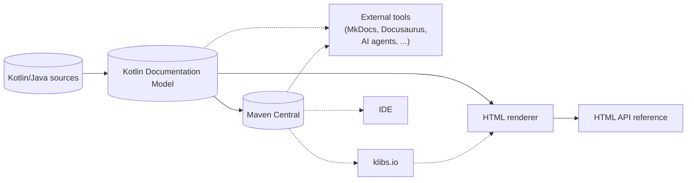

# Kotlin Documentation Model: Motivation & Architecture

* **Type**: Design proposal
* **Author**: Oleg Yukhnevich
* **Status**: Public discussion
* **Discussion**: [#484](https://github.com/Kotlin/KEEP/discussions/484)
* **Related YouTrack issue**: [KT-80323](https://youtrack.jetbrains.com/issue/KT-80323)

## Abstract

This proposal describes the motivation and architecture for the **Kotlin Documentation Model**: a stable,
machine-readable representation of a Kotlin module's KDoc and API surface. The model produced by the Kotlin toolchain
via the [Build Tools API](KEEP-0421-build-tools-api.md), integrated into the Kotlin Gradle Plugin, and published
alongside `sources.jar` to Maven Central. Together with sources, ABI, and other metadata, it will become a first-class
build artifact and serve as the source of truth for documentation tooling, including the first-party HTML renderer,
klibs.io, IDEs, and external tools written in languages other than Kotlin, or when the sources are unavailable.

## Table of contents

- [Background](#background)
- [Motivation](#motivation)
    - [Goals](#goals)
- [Proposal](#proposal)
    - [The model](#the-model)
    - [Producing the model](#producing-the-model)
    - [Consuming the model](#consuming-the-model)
- [Prior art](#prior-art)
- [Design choices](#design-choices)
- [Open questions and call to action](#open-questions-and-call-to-action)

## Background

[KDoc](https://kotlinlang.org/docs/kotlin-doc.html) is the standard way to document Kotlin code, the equivalent of
Java's Javadoc. It lives in `/** */` comments attached to declarations and supports Markdown for the body, links to
other declarations written as `[name]`, and a fixed set of tags such as `@param`, `@return`, and `@sample`. Unlike the
Kotlin language itself, KDoc has no formal specification today: its semantics are defined by the conventions baked into
the compiler-related tooling.

Analysis of Kotlin source code, including KDoc, has converged on
the [Kotlin Analysis API](https://kotlin.github.io/analysis-api/): a stable, public interface for working with Kotlin
code on top of both the K1 and K2 compiler frontends. The Analysis API has recently become the single source of truth
for KDoc analysis: both IntelliJ IDEA and Dokka have migrated to it, replacing their earlier, distinct, but similar
implementations. That migration also surfaced long-standing inconsistencies in KDoc link resolution and has driven
dedicated KEEPs that formalize the resolution rules
([KEEP-0385](KEEP-0385-kdoc-links-to-extensions.md), [KEEP-0389](KEEP-0389-kdoc-streamline-ambiguous-KDoc-links.md)).

On top of the Analysis API sits [Dokka](https://kotl.in/dokka), the official documentation engine for Kotlin. Dokka
reads Kotlin and Java sources, resolves declarations and KDoc through the Analysis API, and produces HTML, Markdown, or
Javadoc-style output. It is distributed as a separate Gradle plugin with its own public, plugin-extensible API.

## Motivation

While the migration to the Analysis API and the recent link-resolution KEEPs have centralized KDoc analysis, the broader
machinery around it still imposes unnecessary costs on both tool authors and library authors.

Dokka itself carries a growing maintenance burden. The most recent rewrite made Dokka powerful and extensible enough to
document any language in any format, but that flexibility came at a cost. Dokka's public API surface has expanded
substantially, making it increasingly difficult to add new features without breaking plugins, and a significant share of
development time goes to keeping everything working rather than to improvements. Dokka also evolves out of sync with the
Kotlin compiler and Kotlin Gradle Plugin and must remain compatible with many compiler versions, K1 and K2, and a wide
range of Gradle setups.

Dokka's strain is a symptom of a deeper issue. The wider landscape of KDoc consumers: documentation engines, IDEs, AI
tooling - all need structured access to Kotlin API and KDoc, but there is no shared, stable representation for them to
consume. Every tool must either reimplement KDoc analysis or take a hard dependency on Dokka. Dokka has carried that
load through repeated rewrites of UI, analysis, formats, and even fundamental architecture - not by choice, but because
each previous design became obsolete as new features and ecosystem demands accumulated.

The cost falls on library authors as well. Dokka depends on Kotlin Gradle Plugin for sources and classpaths, on the
Analysis API for analysis, and is itself shipped as a separate Gradle plugin: generating documentation requires adding
another plugin to the build, aligning its version with supported Kotlin Gradle Plugin version and the Kotlin compiler,
and configuring documentation sources independently of the regular compilation pipeline.

The Analysis API itself does not close this gap. While it works for tools that can call into it in-process, many
consumers in practice cannot. Some are written in other languages: MkDocs plugins are written in Python, and Docusaurus
is written in JavaScript. Others operate without access to Kotlin sources at all - artifact registries, IDEs displaying
quick docs for already-published dependencies (including closed source dependencies), and AI agents working with
published artifacts.

All of this makes documentation feel like a parallel ecosystem rather than an integrated part of Kotlin.

The Kotlin Documentation Model is not a direct replacement for Dokka, and it is not simply Dokka being merged into the
Kotlin toolchain. It proposes a shift in how Kotlin treats documentation: documentation should become a first-class part
of the language and its build pipeline alongside sources, ABI, and other metadata, with a stable machine-readable format
as the integration point for the wider ecosystem.

### Goals

- Define the Kotlin Documentation Model as a machine-readable representation of KDoc and Kotlin API.
- Significantly reduce maintenance costs for KDoc-related machinery.
- Improve the experience of library authors by making documentation an integrated part of Kotlin, not a separate tool.
- Provide better, faster support for new language features by living within the Kotlin toolchain.
- Enable external tools (MkDocs, Writerside, klibs.io, AI agents) to integrate with Kotlin documentation through a
  stable model, without depending on Kotlin-specific APIs.

## Proposal

At the center of this proposal stands the Kotlin Documentation Model: a stable, machine-readable artifact that should be
published alongside each module's other outputs (e.g., `sources.jar`). The architecture around it consists of three
components: model generation from Kotlin and Java sources, an HTML renderer that converts the model into a documentation
website, and integration with the Kotlin toolchain that ties both into the regular build pipeline.

The model should be exposed through a Kotlin library for use from Kotlin code, and a language-agnostic schema for use
from other languages, with Maven Central serving as the distribution channel to consumers that operate without access to
the original build, sources, or the Kotlin compiler.

This KEEP describes the overall architecture and direction. The model specification, the HTML renderer architecture, and
the migration path from Dokka will be addressed separately as work on the Kotlin Documentation Model progresses. The
remainder of this section walks through each piece separately: what the model captures, how it should be produced, and
how it could be consumed.

### The model

The model is meant to outlive the build that produced it. Portability and reproducibility are foundational: the artifact
contains no absolute paths or other build-machine state, so it can be published, fetched, and consumed anywhere,
including by tools that lack the sources or the ability to run the Kotlin compiler. That is what distinguishes it from
an in-process intermediate representation, and what makes Maven Central publication an architectural choice rather than
an afterthought.

The model should cover everything that forms a module's API surface:

- declarations: classes, functions, properties, and so on
- type information: generics, supertypes, parameter types
- visibility, modality, and modifiers
- documented annotations
- KDoc content: descriptions, tags, and links between declarations
- override and inheritance relationships

Processing of both Kotlin and Java sources should be supported. While Kotlin supports interoperability with other
languages on other platforms, C and Swift in Kotlin/Native, JavaScript in Kotlin/JS and Kotlin/Wasm, those languages are
integrated via Kotlin declarations: c-interop-generated declarations for C, `external` declarations, or `JsExport-`
annotated declarations for JavaScript. For Java declarations, the situation is different: Kotlin declarations are not
“generated”; the compiler directly processes original Java sources and binaries, so they should also be processed for
the Kotlin Documentation Model. Java declarations and Javadoc comments should be captured in the same model, in both
classic HTML and newer Markdown forms. The model should support Kotlin Multiplatform specifics, like expect/actual
declarations and source-set-dependent declarations from day one, and not as an afterthought, like it happened with
Dokka.

There is no canonical definition of a "module" at the language or ecosystem level. But different build systems have such
concepts: Gradle calls it a `project`, Maven calls it a `module`, other tools use other names. So, at this point, the
Kotlin Documentation Model will work only at this build tool level: processing the sources of a single "module" and
producing a single artifact per Gradle subproject (or Maven module). Aggregation across multi-module projects belongs to
the model consumers (the HTML renderer, klibs.io, other tools), and to support that, declarations should carry stable
references that could be resolved across modules. Cross-library KDoc links, multi-module HTML renderings, and klibs.io
aggregation all depend on a shared notion of declaration identity, and that identity should be part of the model design
itself.

External references to declarations outside the "module", including those from the JDK, Apple frameworks, and other
libraries, are a related but separate problem. A KDoc link like `[platform.Foundation.NSInputStream]` should ideally
resolve to Apple's published documentation, and a link like `[java.io.InputStream]` to its Javadoc-generated reference,
just as cross-library KDoc links should resolve to the correct place. The model itself cannot carry these URLs, as
concrete documentation locations depend on external resources (vendor sites, registries, user-hosted docs), and
embedding them in the published artifact would tie its contents to the state of those resources at publication time,
reducing reproducibility. Instead, as stated before, the model should expose stable declaration identities, and
translation into external URLs should happen at consumption time.

Compatibility guarantees will mirror the Kotlin language itself. Within a major model version, backward compatibility
should be strict; forward compatibility should hold for one Kotlin version, as in the language itself. Ideally, a single
major model version should cover Kotlin's entire lifetime, so that tools built against an older model version keep
consuming artifacts produced by newer Kotlin versions. The exact rules for what counts as a backward-compatible change,
how new declaration kinds are introduced, and how unknown content is handled are part of the model specification.

While the KDoc itself doesn't have a specification, it shouldn't block the design. The model should be designed so it
can be extended with support for new language features, including refinements to KDoc handling. KDoc is still part of
the language and must evolve without breaking existing solutions, whether in the KDoc syntax or the generated model. The
model's design should be flexible enough to accommodate future language and KDoc improvements without introducing
breaking changes. If the design phase reveals that certain underspecified KDoc behaviors will block further evolution
due to unresolved issues or pending plans, they will be addressed by either designing a model-only representation for
those features or ensuring the architecture remains flexible enough for future implementation without breaking changes.

Here are some examples of such behavior that could affect the model design but might not be specified before the model
is ready:

- consistent `@see` tag support for both KDoc and Javadoc
  ([Dokka#3703](https://github.com/Kotlin/dokka/issues/3703#issuecomment-2288448538))
- `@sample` tag semantics and their distribution, as well as relation to Javadoc's `@snippet` tag
  ([Dokka#3055](https://github.com/Kotlin/dokka/issues/3055), [KTIJ-8414](https://youtrack.jetbrains.com/issue/KTIJ-8414))
- linking to a specific overloaded function
  ([KT-15984](https://youtrack.jetbrains.com/projects/KT/issues/KT-15984), [Dokka\#80](https://github.com/Kotlin/dokka/issues/80))
- other issues related to KDoc spec discovered by the Dokka team
  ([Dokka#4066](https://github.com/Kotlin/dokka/issues/4066)) or
  in [Kotlin YouTrack](https://youtrack.jetbrains.com/issues/KT?q=%7Bkdoc%7D&u=1)

### Producing the model

Producing the model should be a regular part of the Kotlin build configuration.
The [Build Tools API](KEEP-0421-build-tools-api.md) should expose model generation in a build-system-agnostic way, so
that Gradle, Maven, or any other entry point can drive it. The Kotlin Gradle Plugin should wire it into Gradle builds
with no additional plugin and minimal DSL.

Configuration should stay minimal. Sources, classpaths, language version, and other required components for analysis
configuration should come from the build's existing source sets and their configurations, with no parallel setup or
duplicated wiring. Still, one explicit configuration should be present - filtering: declarations can be included or
excluded by visibility, fully qualified names, and annotations - in line
with [Binary Compatibility Validator](KEEP-0440-bcv-to-kgp.md), [Kover](https://github.com/Kotlin/kotlinx-kover), and
similar tools, so authors can shape the published surface (for example, by excluding internal APIs or deprecated
declarations).

Publishing the model to Maven Central alongside `sources.jar` will be configured automatically, but as with sources
publication, it is optional. Once published, the artifact can be consumed without access to the sources, the project's
build, or the Kotlin compiler, unlocking:

- IDE consumers that need API and KDoc without invoking the compiler/analyzer/indexes
- discovery sites such as klibs.io
- AI agents and MCP servers operating on published libraries
- multi-version use cases such as API diffs, tracking of added, removed, or deprecated declarations between versions,
  and versioned documentation

Kotlin will not necessarily ship all of these out of the box, but the architecture should provide the foundation for
them.

### Consuming the model

Any tool that can read the model's schema should be a viable consumer, regardless of the language it is written in or
whether it has access to the sources or build.

Out of the box, an HTML renderer will be provided as the primary consumer. As with model generation, the renderer will
potentially be exposed through the [Build Tools API](KEEP-0421-build-tools-api.md), with the Kotlin Gradle Plugin
offering a Gradle-native way to generate an HTML API reference from a generated model. The same renderer should serve
local builds, klibs.io, and potentially even live in-IDE documentation previews, so that rendered documentation looks
and behaves consistently regardless of which Kotlin version the project uses or where the model is hosted.

The same consumption path should work across different scenarios: a renderer can take a single module's model for a
focused API reference, aggregate multiple modules from a multi-project build into a unified site, or combine models from
unrelated libraries that share the schema. By fetching models from Maven Central, it can also produce documentation for
arbitrary historical versions of a library, without a different consumption path.

Beyond the bundled renderer, the model is a contract that other tools can build on:

- generic Markdown API reference output
- integrations with documentation tools such as MkDocs or Docusaurus
- AI-related use cases such as `llms.txt`-style output, MCP servers, and agent-driven exploration of published libraries

Because consumers depend on a stable schema rather than Kotlin-specific APIs, these integrations do not need to be
written in Kotlin.

Consuming the model raises the question of how to resolve external links. As stated previously, the model itself cannot
carry URLs, but consumers should share a common way to map fully qualified names to URLs from multiple sources:

- well-known documentation websites (JDK, Android, Apple frameworks, kotlinlang.org)
- registries such as [klibs.io](https://klibs.io/) for Kotlin libraries and [javadoc.io](https://javadoc.io/) for Java
  libraries
- user-defined documentation hosts, for example, [api.ktor.io](https://api.ktor.io/)

The bundled HTML renderer should provide this resolution out of the box for Kotlin-to-Kotlin, Kotlin-to-Java, and
Java-to-Kotlin references, with the ability to support others in the future. The detailed design belongs to the HTML
renderer architecture and will be addressed there, including an option to extract this functionality into a separate
component for use by other consumers.

## Prior art

Kotlin is not the first language to ship a machine-readable documentation format. Several language ecosystems already
publish a structured representation of API and documentation alongside (or in place of) rendered HTML:

- **Rust**: [rustdoc-json](https://rust-lang.github.io/rfcs/2963-rustdoc-json.html), a JSON representation of the crate
  API and docs produced by `rustdoc`.
- **Swift**: [DocC](https://www.swift.org/documentation/docc/) archives, bundling a structured JSON ("RenderJSON")
  together with rendered HTML.
- **C#**: [XML documentation](https://learn.microsoft.com/en-us/dotnet/csharp/language-reference/xmldoc/) generated from
  `///` comments and consumed canonically by IDEs and downstream tools.
- **TypeScript**: [TypeDoc](https://typedoc.org/) emits a JSON model of the public API.

Compared to most of these solutions, the Kotlin Documentation Model is positioned as the source of truth for
documentation tooling, rather than a secondary export from an HTML-first pipeline. The bundled HTML renderer, potential
IDE integrations, and external tools (klibs.io, MkDocs, AI agents) all consume the model directly.

## Design choices

This section captures some architectural choices and the alternatives considered.

**Why a dedicated model rather than serializing the Analysis API?**

The Analysis API exposes much more than declarations and KDoc - it covers expressions, calls, and function bodies.
Serializing it would significantly increase artifact size and surface area, without a clear benefit over sources and
binaries. Serializing only the symbol surface of the Analysis API would result in a partial, ambiguous projection of an
intentionally richer API. The use cases driving this proposal - versioned API references, language-agnostic consumers,
AI tooling - have different requirements (stable shape, smaller surface, easy cross-version diffing) than in-process
analysis.

**Why a new model rather than publishing Dokka's documentables?**

Dokka already has internal models (Documentables and Pages). They were designed to drive an extensible HTML pipeline and
carry abstractions (e.g., `ContentPage`) that are generic enough to represent any language. Reusing them as a public
contract would carry forward exactly the maintenance constraints this proposal aims to remove.

**Why a single representation rather than a separate render-ready projection?**

Some ecosystems (specifically Swift's DocC) have both a low-level symbol model and a higher-level render-ready model. A
second projection would simplify renderer implementation, but would require maintaining two representations and baking
layout decisions into the published artifact. Keeping a single representation closer to the code structure leaves the
transformation to render-ready form to consumers - the published model stays stable across rendering decisions, and any
consumer can shape the output however its UI requires.

**Why per-module artifacts rather than project-level aggregation?**

A project-wide artifact would force a project-shaped decision into the model itself, constrain how multi-module projects
can be presented, and complicate publication to Maven Central (which already works well for `sources.jar` at the
per-module level). Scoping the model to one module per artifact keeps the proposal neutral on project shape: the HTML
renderer, klibs.io, and other consumers compose modules as their use case requires, without a one-size-fits-all
aggregation baked in.

**Why ship a bundled HTML renderer rather than leaving rendering to third parties?**

Without it, the most common use case - generating an API reference for a published library - would still require an
external tool, fragmenting the experience and reproducing the setup-cost problem this proposal aims to remove. A bundled
renderer also lets klibs.io serve consistent rendering for any library that publishes the model.

## Open questions and call to action

The design is not yet set in stone. We are actively exploring the best way to represent all Kotlin concepts,
particularly rich references that resolve across modules and Kotlin Multiplatform-specific details. We expect these
answers to evolve as work on the Kotlin Documentation Model progresses.

We would also like community feedback on several open questions:

- How should KDoc and Javadoc content be represented in the model - as a parsed Markdown/HTML tree, or as text
  interleaved with tags and links?
- What kind of extensibility should the model expose? Are custom KDoc tags sufficient, or are richer extension points
  needed (for example, for embedded diagrams, or external content)?
- What format should the machine-readable representation use - JSON, ProtoBuf, or another?

We invite feedback on the proposal as a whole and on these open questions in particular.
