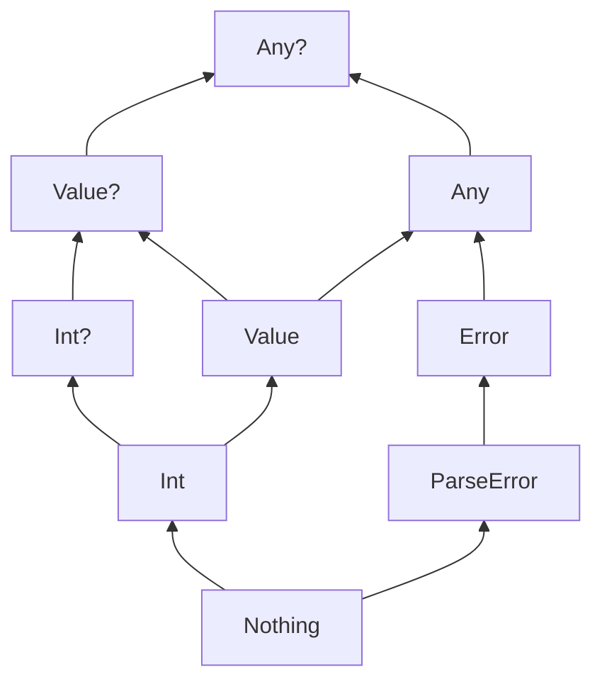
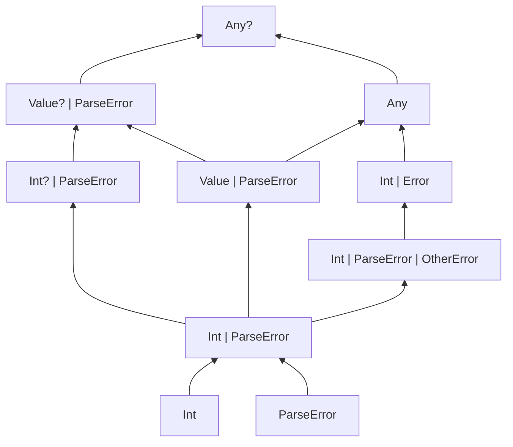
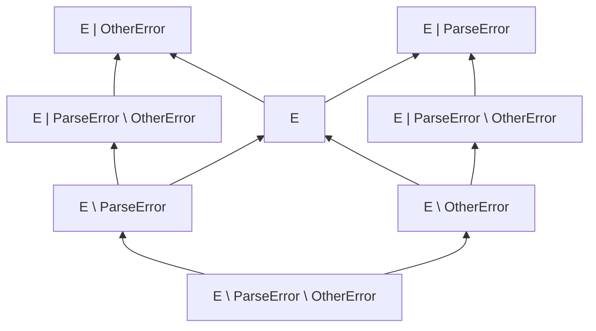

# Rich Errors, aka Error Union Types

* **Type**: Design proposal
* **Authors**: Michail Zarečenskij, Roman Venediktov
* **Contributors**: Alejandro Serrano Mena, Marat Akhin, Ross Tate
* **Discussion**: TBD
* **Related YouTrack issue**: [KT-68296](https://youtrack.jetbrains.com/issue/KT-68296)
* **Status**: Public discussion

## Abstract

This KEEP specifies the design of Rich Errors (or Error Union Types) in Kotlin: a language feature for representing and handling recoverable error cases.

```kotlin
fun load(): User | NotFound

when (val user = load()) {
    is User -> println("Hello, ${user.name}")
    is NotFound -> println("Not found!")
}
```

This KEEP focuses on the formal specification of the feature: syntax, typing, semantics, and ergonomics. 

### Goals

- Clearly communicate errors to programmers through both syntax and semantics;
- Address the ambiguity when `null` is used both as an error and as a value;
- Ensure the type inference algorithm remains polynomial and unambiguous;
- Draw a clear distinction between "exceptions" and rich, predictable errors.

### Non-goals

- Introduce full-blown union types;
- Introduce "checked exceptions" for Kotlin.

## Table of Contents

* [Motivation](#motivation)
* [Proposal](#proposal)
  * [Core idea](#core-idea)
    * [Example:](#example)
  * [Design](#design)
    * [Types](#types)
      * [Error types](#error-types)
      * [Error unions](#error-unions)
      * [Negative types](#negative-types)
      * [Type hierarchy](#type-hierarchy)
      * [Illustrative examples](#illustrative-examples)
      * [Generic parameters](#generic-parameters)
      * [Additional details](#additional-details)
        * [Normalization of types](#normalization-of-types)
    * [Operators and ergonomics](#operators-and-ergonomics)
    * [Smart-casts](#smart-casts)
      * [Use negative information for smart-casts](#use-negative-information-for-smart-casts)
    * [Error traceability](#error-traceability)
  * [Usage patterns](#usage-patterns)
    * [Expressive signatures](#expressive-signatures)
    * [Internal tags and in-place errors](#internal-tags-and-in-place-errors)
  * [Compilation scheme for JVM](#compilation-scheme-for-jvm)
    * [Interoperability with Java](#interoperability-with-java)
  * [Compilation scheme for other backends](#compilation-scheme-for-other-backends)
  * [Migration and compatibility](#migration-and-compatibility)
* [Design rationale](#design-rationale)
  * [Type hierarchy](#type-hierarchy-1)
    * [Why existing nullability operators cannot be reused](#why-existing-nullability-operators-cannot-be-reused)
  * [JVM representation](#jvm-representation)
  * [Operator `|.`](#operator-)
* [Appendix](#appendix)
  * [Java interoperability plugin](#java-interoperability-plugin)
  * [Future extensions](#future-extensions)
    * [Open unions](#open-unions)
    * [Operator `!!`](#operator--1)

## Motivation

Kotlin today supports several distinct error-handling patterns, each effective in its own scope. 
Unchecked exceptions work well for unrecoverable situations, such as precondition failures or framework-level handling. 
For recoverable failures, developers rely on errors-as-values using nullable types, sealed hierarchies, or `Result`-like abstractions. 
While these approaches enable type-safe and explicit handling, they introduce trade-offs: 
`null` is concise but ambiguous, sealed hierarchies are expressive but verbose, and wrapper types require additional operators and boilerplate that obscure business logic. 

As a result, Kotlin provides no first-class way to express recoverable errors. 
This leads to fragmentation across APIs and inconsistent ergonomics. 
The goal of this proposal is to establish a unified, language-level model for recoverable errors,
while improving clarity, composability, and locality of error handling.
The feature targets recoverable error cases, while exceptions continue to represent unrecoverable scenarios.

The full text of motivation with more examples and rationale can be found in the previous [KEEP](https://github.com/Kotlin/KEEP/blob/main/proposals/KEEP-0441-rich-errors-motivation.md).

## Proposal

### Core idea

Any function that may fail in a recoverable way can declare this in its return type using
union types of the form `ValueType | ErrorType1 | ErrorType2 | ...`. In combination with the must-use return values
feature ([KEEP-412](./proposals/KEEP-0412-unused-return-value-checker.md)), the
compiler will report an error if such a result is ignored.

#### Example:

```kotlin
error object NotFound
error object PermissionDenied

fun loadUser(id: String): User | NotFound | PermissionDenied
```

Here, the function explicitly declares the possible error states (`NotFound`, `PermissionDenied`) it can return,
in addition to the success type.

### Design

#### Types

##### Error types

* Errors are defined using a new soft keyword `error`:

  ```kotlin
  error class NetworkError(val code: Int)
  error object NotFound
  ```

All error classes and objects receive a compiler-generated `equals`, `toString` and `hashCode` implementation.

Error types **cannot** have superclasses, superinterfaces, or generic parameters.
Essentially, error types present a new flat hierarchy in the Kotlin type system. It's needed to form only disjoint unions.

In order to compose errors, it's proposed to use type aliases:
```kotlin
typealias UserFetchError = NotFound | PermissionDenied
```

##### Error unions

* The `|` operator is used to unite a value type with one or more error types:

  ```kotlin
  fun foo(): String | NetworkError | DbError
  ```
* Only **one non-error type** may appear in the union, and if present, it must be written leftmost.
* Multiple error types can be freely combined in a union.
* An error union can also have *no* regular type, e.g. for functions that always fail or just report errors:

  ```kotlin
  fun logError(e: NetworkError | ValidationError)
  ```

Note that nullable error types are not allowed in a union, but non-error components can be nullable: 
```kotlin
fun foo(): String? | NetworkError // OK!
fun bar(): String | NetworkError? // compile-time error!
```

It's a question whether we should allow nullable error types on their own though, 
since they could be viewed as `Nothing? | NetworkError`.

##### Negative types

For error types it is allowed to not only state that some error class might be present in this union, but the opposite as well:

```kotlin
fun foo(v: Error \ Error1 \ Error2): { ... } 
```

Here `v` might contain any possible error except `Error1` and `Error2`.
The same might be applied to the type parameters:

```kotlin
fun <E : Error \ Error1> bar() { ... }
fun <E : Error> baz(v: E \ Error1) { ... }
```

To preserve decidable typing and keep type syntax simple and readable, there are several constraints on negative types:
- Only error classifier-like types are allowed on the right-hand side of the `\` operator.
- Negative types should be the right-most component of the error union type.
- Negative types cannot be a component of the union itself, so it is not allowed to declare types like `A | (B \ C) | D`.

When `|` and `\` are used in the same type, they are grouped according to the following rules:
- `|` has higher precedence than `\`;
- repeated uses of `|` are flattened, so associativity is not observable;
- `\` is left-associative.

For example, `A | B | C \ D \ E` is equivalent to `((A | B | C) \ D) \ E`.

##### Type hierarchy

* All error types implicitly extend an abstract class `Error`.
  * The `Error` class cannot be extended explicitly, allowing this to serve as a runtime characteristic of `error` classes.
* `Error` is a subtype of `Any` to keep the supertype of the whole hierarchy the same.
* A new type `Value` is a supertype of all non-error types.

> [!Note]
> Although `Value` appears in the source code as an abstract class, it is not represented as a real class at runtime.
> The compiler handles it specially, similarly to `Nothing`.
> For example, `is` checks for `Value` are compiled as inverted checks against `Error`:
>
> ```kotlin
> fun foo(v: Any) {
>   if (v is Value) { // at runtime: `v !is Error`
>   }
> }
> ```

> [!Note]
> New `kotlin.Error` is not related to `java.lang.Error` in any way here

> [!Note]
> We understand that the class name `Value` may cause terminology confusion with `value` classes.
> However, finding a better name or another way to distinguish these terms remains an open question.

##### Illustrative examples

Here are some diagrams illustrating the type hierarchy and subtyping relationships (an arrow from bottom to top means that the upper type is a supertype of the lower type):







##### Generic parameters

Another limitation required for decidable typing of error unions is that there might be only one generic parameter bounded by the `Error` type in a union:

```kotlin
fun <E : Error> foo(arg: String | E) // correct, E is the only "error" generic parameter

fun <T : Value?, E : Error> bar(arg: T | E) // correct, E is the only "error" generic parameter, T is bounded by `Value?` and disjoint with E

fun <T : Any?> baz(arg: T) // correct, T might be seen as two generic parameters, one for `Error` hierarchy and one for `Value?` hierarchy

fun <E1 : Error, E2 : Error> fooIncorrect(arg: String | E1 | E2) // compilation error: E1 and E2 are two non-disjoint generic parameters in a single union

fun <T /* : Any? */, E : Error> fooIncorrect(arg: T | E) // compilation error: T and E are two non-disjoint generic parameters in a single union
```

##### Additional details

###### Normalization of types

After being passed through the type system, error union types are normalized.
Examples of such normalization include:
- Reduction of repeated components: `Error1 | Error2 | Error1` is normalized to `Error1 | Error2`.
- Reduction of negated components: `E | Error1 | Error2 \ Error1` is normalized to `E | Error2 \ Error1`.
  - If no components remain in the union, the type is normalized to `Nothing`: `Error1 \ Error1` is normalized to `Nothing`.

Type aliases are not normalized at the level of the type alias itself.
They are substituted as written and normalized later as part of the whole type.

#### Operators and ergonomics

To remove any ambiguities and breaking changes, we do not extend the existing nullability operators with error handling support.
Instead, we introduce a new **error-safe-call operator**: `|.`.
The behavior of this operator is similar to the existing `?.` operator and can be expressed using an `if` expression as follows:

```kotlin
val result = foo()|.bar()
// equivalent to
val tmp = foo()
val result = if (tmp is Error) tmp else tmp.bar()
```

This operator allows error handling to be delayed until the end of the chain, leading to a clearer separation between the successful computation path and error-processing logic:

```kotlin
error object FeatureDisabled
error object NoData

fun loadFromAGP(): Model | NoData
fun Model.computeTask(): Task | FeatureDisabled

fun accumulateErrors() {
    // resulting type is Task | NoData | FeatureDisabled
    when (val task = loadFromAGP()|.computeTask()) {
        is Task -> println("OK")
        is FeatureDisabled -> println("Feature is disabled")
        is NoData -> println("No data")
    }
}
```

Similar to the `?.` operator, `|.` introduces an implication that can be used for smart casts:

```kotlin
fun foo() {
    val model: Model | NoData = loadFromAGP()
    val task: Task | NoData | FeatureDisabled = model|.computeTask()
    // Smart-casting implication: task !is Error => model !is Error
    if (task is Error) return
    // `model` can be smart-cast to `Model` here
}
```

> [!Note]
> We understand that `|.` may seem a bit unusual at first. However, this is largely because it is a new operator. 
> With time and familiarity, we believe it will feel natural and become easily recognizable to Kotlin users.
> Especially considering `|.` is similarly related to the `T | E` type as `?.` to the `T?`.

> [!Note]
> There is no `?|.` operator to short-circuit on `null` values and errors. 
> The reason is that such a variety of different safe call operators will be confusing for the reader.
> At the same time, we do not expect null-based and error-based APIs to coexist locally in the future.
> So these rare cases will require some explicit handling for the sake of readability of the language in general.

On the other side, **bang-bang operator** `!!` and **elvis operator** `?:` will not have any counterparts for error unions.
The main reason for it is that we do not want to extend the existing operators with error handling support due to backward-compatibility concerns.
The details could be found in the section [Why existing nullability operators cannot be reused](#why-existing-nullability-operators-cannot-be-reused).

Instead, we are introducing standard functions with the same behavior for explicit handling:

```kotlin
inline fun <T : R, R : Value, E : Error, ER : Error> (T | E).ifError(onError: (E) -> (R | ER)): R | ER {
    contract {
        callsInPlace(onError, InvocationKind.AT_MOST_ONCE)
        (this@ifError is Error) holdsIn onError
    }
    return if (this is Error) onError(this) else this
}

inline fun <T : Value, E : Error> (T | E).ifError(onError: (E) -> Nothing): T {
    contract {
        returns() implies (this@ifError is Value)
        callsInPlace(onError, InvocationKind.AT_MOST_ONCE)
        (this@ifError is Error) holdsIn onError
    }
    return if (this is Error) onError(this) else this
}

fun Error.throwError(): Nothing {
    throw KotlinErrorException(this)
}

fun <T : Value?, E : Error> (T | E).throwIfError(): T {
    contract {
        returns() implies (this is Value?)
    }
    return ifError { it.throwError() }
}
```

The four type parameters in the `ifError` function allow adjusting both the error and value types:

```kotlin
sealed interface Sealed
class Child1 : Sealed
class Child2 : Sealed

error object Error1
error object Error2
error object Error3

fun foo(v: Child1 | Error1 | Error2) {
    val v2: Sealed = v.ifError { Child2() } // T = Child1, R = Sealed, E = Error1 | Error2, ER = Nothing
}

fun bar(v: Int | Error1 | Error2) {
    val v2: Int | Error3 = v.ifError { e ->
        when (e) {
            is Error1 -> Error3
            is Error2 -> e.throwError() // Unrecoverable case
        }
    } // T = R = Int, E = Error1 | Error2, ER = Error3
}

fun baz(v: Int | Error1 | Error2) {
    v.ifError { return it } // resolves to the second overload, allowing v to be smart-casted to Int after the call
}
```

#### Smart-casts

The already existing smart-casting mechanism works perfectly with rich errors.
Actually, we already used it in the function `ifError` from the previous section:

```kotlin
inline fun <T : R, R : Value, E : Error, ER : Error> (T | E).ifError(onError: (E) -> (R | ER)): R | ER {
    return if (this is Error) onError(this) else this
}
```

The `onError` parameter expects `E`, but we check `this is Error`, where `Error` is a _supertype_ of `E`, 
and it still works — we can pass `this` to `E`. How?
Because in Kotlin, smart casts perform type intersection, not a direct cast to the `is` type. 
After the smart cast, the type of `this` becomes `(T | E) & Error`, which then simplifies to `E` through the chain:

```
(T | E) & Error ~> T & Error | E & Error ~> Nothing | E ~> E
```

It also works the same way in more grounded examples:

```kotlin
fun foo(v: String | Error1) {
    if (v is Error) {
        // v is smart-casted to Error1
        return
    }
    // v is smart-casted to String
}

typealias FileSystemErrors = FileNotFound | FileAlreadyExists | AccessDenied | FileTooLarge | ...

fun bar(v: String | FileNotFound | AccessDenied) {
    if (v is FileSystemErrors) {
        // v is smart-casted to FileNotFound | AccessDenied
    } 
}
```

##### Use negative information for smart-casts

Negative information is already used in Kotlin for exhaustiveness ([KEEP-0442](https://github.com/Kotlin/KEEP/blob/main/proposals/KEEP-0442-dfa-exhaustiveness.md)), and it will also work for error unions:

```kotlin
fun foo(): String | Error1 | Error2

fun bar() {
    val x = foo()
    if (x is Error1) return
    when (x) {
        // `is Error1` is not required 
        is Error2 -> println("Error2")
        is String -> println(x)
    }
}
```

However, with errors, it becomes more important to support negative smart casts:

```kotlin
fun foo(): String | Error1 | Error2

fun bar() {
    val x = foo()
    if (x is Error1) return
    // x is smart-casted to String | Error2
    if (x is Error2) return
    // x is smart-casted to String, and now you can just call common String methods on it
    println(x.length)
}
```

Negative smart-cast might not just filter out an explicit error class from the union but also introduce a negative type:

```kotlin
fun <T : Any> foo(v: T) {
    if (v is Error1) return
    // v is smart-casted to T \ Error1
}
```

> [!Note]
> As negative smart-casting is a new feature for the compiler, it adds significant complexity to the implementation. 
> Thus, it might be delivered later than error unions themselves.

#### Error traceability

Let's reiterate the following example:

```kotlin
fun fetch(): User?
fun User.charge(): Transaction?

fun foo() {
    val transaction = fetch()?.charge()
    if (transaction == null) {
        // what should we do here?
    }
}
```

With such a design, it is not possible to disambiguate between two possible sources of failure, `fetch` and `charge`, which may end up in incorrect error handling in a more complex scenario.
But with error unions, it is possible to declare different error types for each function and non-ambiguously handle both cases:

```kotlin
fun fetch(): User | NoSuchUser
fun User.charge(): Transaction | TransactionCancelled

fun foo() {
    val transactionResult = fetch()|.charge()
    if (transactionResult is Error) {
        when (transactionResult) {
            is NoSuchUser -> println("User not found")
            is TransactionCancelled -> println("Transaction cancelled")
        }
    }
}
```

But such a disambiguation does not work for all cases as the same error might happen in different functions:

```kotlin
fun resolveUser(viewer: UserId): User | AccessDenied
fun User.medicalRecord(): MedicalRecord | AccessDenied

fun foo(viewer: UserId) {
    val record = resolveUser(viewer)|.medicalRecord(viewer)

    if (record is Error) {
        when (record) {
            is AccessDenied -> println("Access denied") // which one?
        }
    }
}
```

To prevent this case from happening, we prohibit merging of errors from different sources.
In the previous example, `AccessDenied` might come from two different sources: 
through chain short-circuiting from `resolveUser` and as a result of `medicalRecord`.
For this reason, this code is rejected as a compilation error.
To work around this properly, one must split this chain call into separate ones and handle the errors unambiguously:

```kotlin
fun resolveUser(viewer: UserId): User | AccessDenied
fun User.medicalRecord(): MedicalRecord | AccessDenied

fun foo(viewer: UserId) {
    val user = resolveUser(viewer)
    if (user is AccessDenied) {
        println("Access to user denied")
        return
    }
    val medicalRecord = user.medicalRecord(viewer)
    if (medicalRecord is AccessDenied) {
        println("Access to medical record denied")
        return
    }
}
```

While this restriction requires more verbosity in error handling, it is for the better as it prevents programming mistakes and encourages proper error handling.
Moreover, we do not expect different error types to be merged often as different steps of the chain usually perform different tasks and may produce a different set of errors.

Another possible source of ambiguity could be demonstrated with the following example:
```kotlin
fun <T> List<T>.firstOrError(): T | NoSuchElement

fun foo(list: List<Any>) {
    val element = list.firstOrError()
    if (element is NoSuchElement) {
        // Is it because the list was empty or because the first element was `NoSuchElement`? 
    }
}
```

Such a mistake is quite common even now with the `firstOrNull` function.
To prevent this, we disallow non-disjoint error unions in the function signatures.
As a result, the declaration of `firstOrError` would be rejected.
The correct way of declaring such a function is to exclude `NoSuchElement` from `T` with the negative type:

```kotlin
fun <T : Any? \ NoSuchElement> List<T>.firstOrError(): T | NoSuchElement

fun fooIncorrect(list: List<Any>) {
    val element = list.firstOrError() // compilation error: type parameter for the second call is not within bounds
}

fun fooCorrect(list: List<Any>) {
    val element = if (list.isNotEmpty()) list[0] else { 
        // process the empty list case
    }
}
```

The same might happen in the generic function:

```kotlin
fun <V> applyToFirst(list: List<V>, f: (V) -> Unit) {
    val first = list.firstOrError()
    if (first is NoSuchElement) return
    f(first)
}
```

In this example, the call to `firstOrError` would not compile as `V` might contain `NoSuchElement` as a subtype.
It is also correct in this case, as this call makes indistinguishable `NoSuchElement` as if there were no elements (which should not be passed to `f`) 
and `NoSuchElement` as if it is the first element (which should be passed to `f`).
To overcome this and to achieve the correct behavior, one must implement this function using only functions that will not lead to any ambiguity:

```kotlin
fun <V> applyToFirst(list: List<V>, f: (V) -> Unit) {
    val first = if (list.isNotEmpty()) list[0] else return
    f(first)
}
```

While it is not that complicated in the current case, there might be some more complex function instead of `firstOrError`.
In these cases, it might be easier to say that the outer function (`applyToFirst`) just inherits constraints from the inner one (`firstOrError`), with the upper bound `Any? \ NoSuchElement` for `V`:

```kotlin
fun <V : Any? \ NoSuchElement> applyToFirst(list: List<V>, f: (V) -> Unit) {
    val first = list.firstOrError()
    if (first is NoSuchElement) return
    f(first)
}
```

To summarize, the error traceability restriction is applied in the two cases:
- For the chaining operator `|.`, it is required that an error component of the receiver is disjoint from the error component of the function's inferred return type.
- All error unions in the function signatures are required to be disjoint.

### Usage patterns

#### Expressive signatures

The error union model enables functions to express their ability to fail in their type, eliminating ambiguity:

* Instead of returning `null` for “not present”, use:

  ```kotlin
  error object NotPresent

  operator fun <K, V> Map<K, V>.get(key: K): V | NotPresent
  ```
* Instead of throwing `NumberFormatException` from parsing:

  ```kotlin
  error object InvalidFormat

  fun String.toInt(): Int | InvalidFormat
  ```

#### Internal tags and in-place errors

Error objects can also be useful for implementation-internal control flow.
In this role, an error does not describe a public API failure mode but acts as a scoped tag for an intermediate algorithmic state.
Because the tag is internal to the library, it cannot collide with any external value passed to the function.
The following example illustrates this:

<table>
<tr>
<td>

```kotlin
@PublishedApi
internal error object InternalNotFound

inline fun <T> Sequence<T>.last(predicate: (T) -> Boolean): T { 
  var last: T | InternalNotFound = InternalNotFound
  for (element in this) {
    if (predicate(element)) {
      last = element
    }
  }
  if (last == InternalNotFound) throw NoSuchElementException()
  return last // smart-cast to T
}
```

</td>
<td>

```kotlin
inline fun <T> Sequence<T>.last(predicate: (T) -> Boolean): T {
  var last: T? = null
  var found = false
  for (element in this) {
    if (predicate(element)) {
      last = element
      found = true
    }
  }
  if (!found) throw NoSuchElementException()
  @Suppress("UNCHECKED_CAST")
  return last as T
}
```

</td>
</tr>
</table>

In this example, `InternalNotFound` represents the internal "not found yet" state.
This keeps the state in a single variable and makes the final check precise: after `last == InternalNotFound` is excluded, `last` can be smart-cast to `T`.
Compared with the nullable implementation, this avoids an additional boolean flag and removes the need for an unchecked cast.

### Compilation scheme for JVM

On the JVM platform, any error union type will be represented as a `java.lang.Object` where neither of the components is boxed.
Due to the disjointness of the type hierarchies for error types and common types, it will always be possible to distinguish between them using ordinary runtime type checks. 
This representation avoids the overhead of boxing and unboxing, making error handling almost overhead-free.

> [!Note]
> For primitive types boxing will take place to make the whole type reference-based.

On the other hand, it makes signatures of such functions too imprecise or even unsafe from the Java perspective:

```kotlin
fun foo(): String | Err1 { ... }
// From the Java perspective: foo(): Object, very uninformative

fun bar(s: String | Err1) { ... }
// From the Java perspective: bar(Object), allowing any object to be passed, leading to runtime errors
```

For this reason, all functions with the error union in the signature will be mangled and hidden from the Java world.
The mangling scheme is going to be very similar to the one for 
[inline classes](https://github.com/Kotlin/KEEP/blob/main/proposals/KEEP-0104-inline-classes.md#mangling-rules): 
`<name>-<hash>` where `<name>` is the original name of the function and `<hash>` is a hash of the unerased function's signature.

> [!Note]
> A direct consequence of this is that any change to the set of errors in a signature is binary-incompatible, even if it is hidden behind a type alias.
> This could be mitigated with a different hashing scheme, for example, by computing the hash based only on the presence of an error union, rather than on its precise type.
> However, it is unclear whether this would be useful, since such changes are still source-incompatible and are therefore likely to be avoided by libraries anyway.
> For scenarios where API evolution is important, we are considering introducing [open unions](#open-unions), which would make such changes both source- and binary-compatible.

For classes that use union types as bounds for their type parameters,
all their constructors will be hidden along with methods that reference these type parameters. 
If unions are not used in the bounds for type parameters but used in other signatures,
only related signatures will be hidden.

We realize that such an approach might be problematic for some users, but it is the only possible option we see. 
Moreover, it is comparable with the current approach for `Result`, which is not mangled but still produces an unsafe signature and is hidden from Java callers by the IDE.

#### Interoperability with Java

Kotlin is often used in mixed Java/Kotlin codebases, so it is important to provide a way to expose APIs with error unions to Java.
At the same time, error-union signatures are hidden from Java by default.

The interoperability story here is similar to other Kotlin-specific abstractions: 
they are not necessarily translated to Java automatically but can be exposed through explicit adapter APIs.
For example, coroutine libraries provide adapters such as [`kotlinx-coroutines-reactor`](https://kotlinlang.org/api/kotlinx.coroutines/kotlinx-coroutines-reactor/), 
which convert coroutine concepts to Reactor types.

For rich errors, we propose the same general approach: Java interoperability should be explicit and opt-in.
Such adapters could be written manually or generated by tooling such as KSP or compiler plugins.
We plan to provide one such plugin, which exposes annotated functions with error unions in their signatures to Java.
It maps error unions in return types to exceptions, and error unions in parameter positions to overloads:

```kotlin
@JvmExposeErrors
fun foo(arg: String | Err1 | Err2): List<String> | Err3 | Err4

// turns into:
@Throws(Err3.Exception::class, Err4.Exception::class)
fun foo(arg: String): List<String>

@Throws(Err3.Exception::class, Err4.Exception::class)
fun foo(arg: Err1): List<String>

@Throws(Err3.Exception::class, Err4.Exception::class)
fun foo(arg: Err2): List<String>
```

More details of the plugin are described in the [Appendix](#java-interoperability-plugin).

### Compilation scheme for other backends

For non-JVM backends, the representation strategy is the same as on the JVM: error unions do not require wrappers. Values of error-union types are represented directly as one of the component types using the backend’s ordinary value representation, as if it had type `Any`.

However, the foreign-language interop story differs by backend.

In Kotlin/Native, the same concerns that apply to the JVM also apply to Objective-C and Swift interop. As a result, declarations with error-union signatures are not exported to Objective-C or Swift.

Kotlin/JS and Kotlin/Wasm, on the other hand, can represent error unions in generated `.d.ts` files. For example:

```kotlin
@JsExport
fun loadUser(): User | NotFound | PermissionDenied
```

is exported as:

```typescript
export function loadUser(): User | NotFound | PermissionDenied;
```

Therefore, declarations with error-union signatures can be exported in Kotlin/JS and Kotlin/Wasm, provided that the exported types do not contain negative types.

### Migration and compatibility

The migration strategy is always essential and far from trivial for an existing language. It should be worked out in
detail, especially given that error handling concerns almost everyone. We'll describe it in upcoming documents. Here,
we’d like to highlight that it is an important aspect for us and we have the following potentially affected APIs:

* Nullable-returning APIs that encode "optional" pattern.
* Standard library APIs will gain error-union alternatives (`XOrError`), coexisting with existing nullable and throwing
  versions for compatibility.
* Custom wrappers (`Result`, `Either`, etc.) can interop with error unions via straightforward conversion and
  be gradually replaced with unions.

## Design rationale

As it is a completely new feature, the design space for each part of it is extremely wide.
As a result, some of the design decisions might seem questionable at first glance.
We'll try to explain our reasoning behind them in the following sections.

### Type hierarchy

One of the most significant changes compared to the previous design is that we made the `Error` type a subtype of `Any`.
The main reason behind this design choice is to keep all generic code working and automatically extend to error unions.

With the previous approach (where `Any? | Error` becomes a new supertype), 
the default upper bound for generic parameters (`Any?`) is no longer the most generic type.
There are two possible approaches to solve this issue:
- Keep `Any?` as a default upper bound for generic functions. 
  This approach has several major drawbacks: 
  - All generic functions will have to explicitly write a new total upper bound `Any? | Error`.
    And for most of the cases, it is the only thing that needs to be changed as the implementation is totally agnostic to the values of this type (like all collections and their extension functions).
    As different libraries will update their declarations at different points in time, 
    it will create some messy state when some parts of the ecosystem support rich errors, while others do not.
  - While migration from `Any?` to `Any? | Error` is a binary compatible change (both represented as an `Object`), it is not source compatible.
    This might be demonstrated by the following example:
    ```kotlin
    class List<T /* : Any?*/> {...}
    
    fun foo(list: List<*>) {
        val element: Any? = list[0] // perfectly correct, we do not know anything about the value, so ascribe it the most general type
    }
    ```
    If we change the upper bound of the `T` in the `List` class to `Any? | Error`, then the code will no longer compile.
    As a result, some parts of the ecosystem might not be able to update their declarations, and rich errors will be forever in the partially supported state.
- Updating the default upper bound for generic functions to `Any? | Error` is even more problematic, as it would enforce a source-incompatible change for all users, which is unacceptable.

There are other, less critical issues with this type hierarchy: for example, checks for `is Any` will change their runtime behavior once rich errors are introduced.

As a result, with the previous design it is impossible to flawlessly adopt rich errors in the ecosystem, without unacceptable breaking changes.

On the contrary, with the new design, where `Error` is a subtype of `Any`, everything flawlessly starts supporting rich errors.
It is essentially nothing different from the addition of a new class in some other place of the codebase.
`Any?` is still a type that represents no information about the value, any value of type `Any` still has expected methods (`toString`, `hashCode`, `equals`).

#### Why existing nullability operators cannot be reused

One consequence of making `Error` a subtype of `Any` is that error values may appear in places where the static type does not explicitly mention errors.
For example, a value of type `Any`, `Any?`, or a generic type parameter with the default upper bound `Any?` may in fact contain an error value.

This makes it problematic to repurpose existing nullability operators for error handling.
Operators such as `?.`, `?:`, and `!!` are already defined for expressions whose static type may be `Any?`.
If their semantics were extended to recognize errors in addition to `null`, 
existing valid Kotlin programs could change their behavior without any visible change in their source code.

For example, today `x!!` only checks that `x` is not `null`, and therefore can be safely used in the following scenario:

```kotlin
fun foo(f: () -> Any?) {
    val value by lazy { f() }
    if (value != null) {
        value!!.doSomething() // never throws
    }
}
```

If `!!` were changed to treat some non-null values differently, this function could silently start throwing for values that it previously accepted.
This would be a source-compatible-looking change with different runtime behavior, which is not acceptable for existing code.

The same issue applies to `?.` and `?:`.
For example, a safe call on an expression of type `Any?` currently short-circuits only on `null`.
If it also short-circuited on errors, then existing code that stores arbitrary objects in `Any?`-typed values would acquire new control-flow behavior.
Similarly, extending `?:` to handle errors would change when its right-hand side is evaluated.

For this reason, the proposal introduces a dedicated error-safe-call operator, `|.`, instead of changing the meaning of `?.`.

### JVM representation

Representation of any error union as `Object` might seem very imprecise and limiting as it leads to mangling of all functions with error unions.
It might seem that wrapping it into some box could be a good idea, but there are several issues with this approach:
- This makes subtyping of error unions impossible:
  ```kotlin
  fun foo(argFoo: List<String | MyError>) { ... }
  
  fun bar(argBar: List<String>) {
      foo(arg) // impossible: values `argBar` are not boxed, while in `argFoo` they are expected to be boxed
  }
  ```
  And it becomes even more complicated for generics, where we do not even know if the value is boxed or not:
  ```kotlin
  fun <T> foo(arg: T) {
      if (arg is String) { // changes from just `arg instanceof String` 
                           // to `arg instanceof String || arg instanceof Box && arg.getValue() instanceof String`
      }
  }
  ```
  As a result, instead of convenient union semantics it will become just another awkward `Either`-like wrapper.
- Even boxing does not solve interoperability with Java:
  ```kotlin
  fun foo(arg: String | MyError1 | MyError2) { ... }
  fun bar(): String | MyError1 | MyError2 { ... } 

  // from Java perspective:
  //   foo(Box<String, Error>) -> void
  //   bar(): Box<String, Error>
  ```
  Due to the absence of unions in Java, it won't be possible to properly express cases with more than one error involved.
  As a result, it will be possible to pass any error to the function `foo`, which is unsafe and will end up in a class cast exception at runtime.
  And for the function `bar`, the returned type does not provide any useful typing information, 
  to figure out what errors must be handled requires reading the original signature of the function, 
  and this is not checked by the compiler in any way.

### Operator `|.`

During the discussion of the proposal’s motivation, the most commonly suggested chaining operator was `!.`. 
We considered this option as well, but ultimately chose `|.` for a single reason.

The purpose of the chaining operator is to safely propagate errors so they can be handled later. 
As such, it should not draw excessive attention in code. 
The symbol `!`, however, carries the opposite connotation: in Kotlin it is associated with unsafe operation `!!`,
and more broadly it tends to signal something exceptional or potentially dangerous in many natural languages.
To preserve this established meaning, we avoided using `!` for safe semantics and instead chose `|`, 
which is already used in error union types and therefore more naturally conveys the intended behavior.

## Appendix

### Java interoperability plugin

While we do expect some community-driven interoperability plugins, we would like to provide one on our own to make the migration to rich errors easier.
As was mentioned above, the plugin will transform top-level error unions into exceptions for the return types and into overloads for the arguments:

```kotlin
@JvmExposeErrors
fun foo(arg: String | Err1 | Err2): List<String> | Err3 | Err4

// turns into:
@Throws(Err3.Exception::class, Err4.Exception::class)
fun foo(arg: String): List<String>

@Throws(Err3.Exception::class, Err4.Exception::class)
fun foo(arg: Err1): List<String>

@Throws(Err3.Exception::class, Err4.Exception::class)
fun foo(arg: Err2): List<String>
```

All of these overloads will call the original function by just passing the value to it. 
After the call, they will have a single `when` expression that will transform errors into exceptions or just return the result if no errors occurred.

The transformation for arguments is very straightforward, it just unrolls the union into a series of overloads.

For the return types, the transformation requires some mapping from the error type to the corresponding exception class as errors cannot inherit from `Throwable`.
The exact mapping is yet to be decided. But we consider a couple of options:

```kotlin
@AssociatedException
error object Err1
// for annotated error classes, the plugin will generate a class Err1.Exception that inherits from Throwable and wraps the error

// or

error object Err2 {
    fun asException(): FileNotFoundException { ... }
}
// the plugin will take the return type of the function as the type of the exception for the `throws` statement and use this function for mapping from the error to the exception
```

The plugin would not be able to handle signatures where errors are not at the top level, for example, if the return type is `List<String | Err1 | Err2>`.
While this might seem limiting, we do not expect cases like this to happen in practice.
This is because errors are intended to signal exceptional situations and be handled instead of being carried around.
While it is possible to imagine cases that might want to use errors in generic parameters, 
and it would not be an abuse of the feature,
by inspecting real libraries, we encountered almost no such cases, especially in the API surface.
This means that these rare functions can be exported to Java manually.

### Future extensions

There are several possible future extensions to the proposal that we already consider. 
While they might not be introduced simultaneously with rich errors, they might be added at some point in the future.

#### Open unions

In some cases, the exact set of errors that a function might produce cannot be fixed beforehand.
Some changes in the library might lead to new errors being introduced.
To make these changes backwards compatible, we might introduce an open union type:

```kotlin
fun foo(): Int | Error1 | Error2 | *

fun handleOpenUnion() {
    val result = foo()
    if (result is Error) {
        when (result) {
            is Error1 -> { ... }
            is Error2 -> { ... }
            else -> { ... }
        }
    }
}
```

In such a case, the `*` is used to represent that some other error might be introduced in the future.
So, to properly handle this union, we need to ensure that we cover all possible error cases and provide a default handling for any unexpected errors with the `else` branch.

One important interaction between open unions and [error traceability restriction](#error-traceability) is that open unions cannot be safely chained with any other error-returning functions:

```kotlin
fun foo(): Int | Error1 | Error2 | *
fun Int.bar(): String | Error3

fun chainOpenUnion() {
    foo()|.bar() // Compilation error: `Error3` might already be included in `*`
    foo()|.toString() // Ok, `toString` does not introduce new errors
}
```

Since `*` represents an arbitrary future error, the compiler cannot determine whether newly introduced errors are distinct from those already included in the open union.
As a result, chaining is only allowed for operations that do not introduce additional errors.

#### Operator `!!`

While we do not want to re-purpose existing nullability operators for rich errors, the operator `!!` might be useful for some cases.
It allows easily transforming an expected failure into an unexpected one in cases where this exact state is not expected.

As was already mentioned in the section [Why existing nullability operators cannot be reused](#why-existing-nullability-operators-cannot-be-reused), 
the main issue with this idea is that it is not backward-compatible.
But the behavior of the operator `!!` changes only in cases where the argument is not a subtype of `Value?` (meaning it is `Any`, `Any?` or equivalent type), which is not a common case.
So it is possible to re-purpose it for rich errors with the following migration strategy:
- Firstly we deprecate the operator `!!` for cases where its argument is not a subtype of `Value?`. This will require a long deprecation cycle:
  - During two major versions, the warning will be reported to allow flawless migration.
  - During two major versions, the operator `!!` will require its argument to be a subtype of `Value?` to ensure that there are no cases left that will change their behavior.
- Then we re-introduce the operator `!!` with the new behavior that throws on errors and nulls. 

While this migration strategy may seem somewhat complex, it is necessary to ensure a smooth and safe migration.
