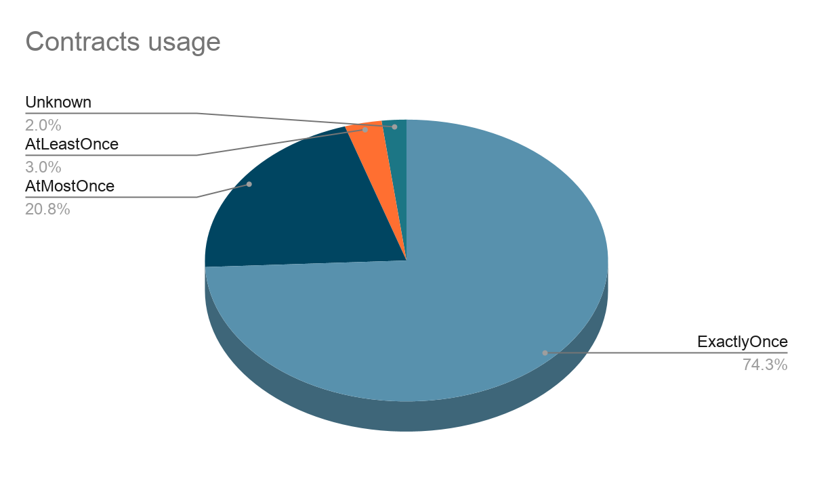
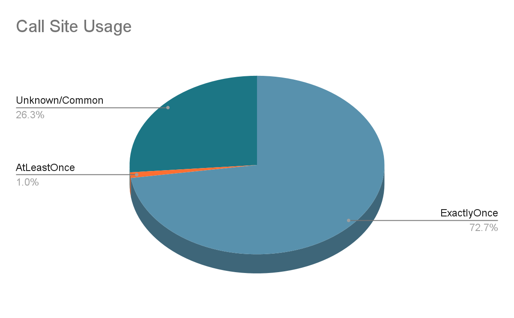
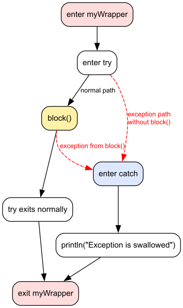

# Local lambda parameters (aka stable callsInPlace)

* **Type**: Design proposal
* **Authors**: Yuliya Karalenka, Michail Zarečenskij
* **Contributors**: Marat Akhin, Alejandro Serrano Mena, Komi Golova, Roman Venediktov, Mikhail Vorobev
* **Status**: Internal review
* **Discussion**: TBD

## Abstract

Currently all lambda parameters in Kotlin are treated as escaping by default. This means they can be executed after the function call finishes. In real code, many lambdas are executed only during the function call. This behaviour is described in Kotlin with `callsInPlace` contract. Also, regular `inline` lambda parameters already have in-place behavior by default.

```kotlin
fun example(escapingLambda : () -> Unit, callsInPlaceLambda : () -> Unit) {
    contract {
        callsInPlace(callsInPlaceLambda, InvocationKind.UNKNOWN)
    }
    globalStorage = escapingLambda // escapes
    callsInPlaceLambda()  // executed in place
}
```

The development of the new checker has demonstrated that `callsInPlace` is becoming more than just a contract for library authors It is already the most popular contract:

Total contract hits on github: [18.3k](https://github.com/search?q=%2Fcontract%5Cs*%5C%7B%28%3Fs%29.*%3F%28callsInPlace%7Cimplies%7CholdsIn%29.*%3F%5C%7D%2F+language%3AKotlin&type=code)

`callsInplace` contract hits on github: [11.8k](https://github.com/search?q=%2Fcontract%5Cs*%5C%7B%28%3Fs%29.*callsInPlace%5Cs*%5C%28%5B%5E%29%5D*%28EXACTLY_ONCE%7CAT_MOST_ONCE%7CAT_LEAST_ONCE%7CUNKNOWN%29%5B%5E%29%5D*%5C%29.*%3F%5C%7D%2F+language%3AKotlin&type=code)

This popularity is expected: `callsInPlace` gives the compiler information about lambda execution order, which enables additional smart casts and definite-assignment analysis. These capabilities are described in more detail in [Current State & Capabilities](#current-state--capabilities).

However, the current contract syntax is still experimental and has several design limits: it is verbose, cannot be used in functions without bodies, and not fully verified.

Because of that, stabilizing the current form may not be enough. We propose to introduce new syntax. The goal is to keep the useful behavior of `callsInPlace`, make it stable, and remove the main drawbacks of the current contract-based design.

## Table of contents

* [Table of contents](#table-of-contents)
* [Current State & Capabilities](#current-state--capabilities)
  * [Common](#common)
  * [EXACTLY_ONCE](#exactly_once)
  * [AT_MOST_ONCE](#at_most_once)
  * [AT_LEAST_ONCE](#at_least_once)
  * [UNKNOWN](#unknown)
* [Current Drawbacks and Limitations](#current-drawbacks-and-limitations)
  * [Missing Features](#missing-features)
  * [Design Flaws](#design-flaws)
* [Design of local](#design-of-local)
  * [Deconstructing: Locality and Invocation Count](#deconstructing-locality-and-invocation-count)
  * [Verification of `local`](#verification-of-local)
* [Distribution of Invocation kinds usage](#distribution-of-invocation-kinds-usage)
  * [Raw Usage Counts](#raw-usage-counts)
  * [Call site usage analysis](#call-site-usage-analysis)
* [Design of `once`](#design-of-once)
  * [Verification for `local once`](#verification-for-local-once)
* [Migration](#migration)
  * [Composable lambdas](#composable-lambdas)
  * [Array constructor](#array-constructor)
  * [Migration plan](#migration-plan)
* [Inheritance](#inheritance)
* [Compatibility with Ross Tate locality](#compatibility-with-ross-tate-locality)

## Current State & Capabilities

Let's recap the syntax of `callsInPlace` and what functionality it has.

### Common

The `callsInPlace` guarantees that if the lambda is executed, it is executed before the function returns.

The contract can also specify how many times the lambda is guaranteed to be executed by using an `InvocationKind`.

Because the lambda is executed in place, the compiler knows enough of the execution order to allow some more smart casts. In this example, the lambda passed to `someFunction` is executed before `x = null`, so `x` can be smart-cast to `String` inside the lambda.

```kotlin
fun useCaseCallsInPlace() {
    var x: String? = "hello"
    if (x != null) {
        someFunction(true) {
            // After adding a contract with callsInPlace
            // x is smartcasted to String
            println(x.length)
        }
    }
    x = null // Variable may change before the lambda executes.
}
```

### EXACTLY_ONCE

Invocation count: k == 1

One-time initialization of captured `val`

Because the lambda is executed exactly once, the compiler can allow initialization of a `val` declared outside the lambda. It knows that the assignment happens once before the value is used.

```kotlin
fun useCase1() {
    val reportStatus: String // Declared outside as val
    buildList {
        add(1)
        add(2)
        reportStatus = "Completed"
    }
    println(reportStatus) // Compiler knows this is initialized.
}
```

### AT_MOST_ONCE

Invocation count: 0 <= k <= 1

The lambda may be executed once or not executed at all. The compiler can allow assignment to a captured `val` inside the lambda, because the lambda cannot run more than once.

```kotlin
fun useCase1AtMostOnce() {
    val reportStatus: String // Can be initialized as val, someFunctionAtMostOnce will be executed 0..1
    someFunctionAtMostOnce(true) {
        reportStatus = "Completed"
    }
    // println(reportStatus) // Error: reportStatus may be uninitialized.
    // reportStatus = "Failed" // Error: reportStatus may already be initialized.
}
```

After the call, the compiler does not know whether the assignment happened. Therefore, the `val` cannot be read, because it may be uninitialized. It also cannot be assigned again, because it may already be initialized.

### AT_LEAST_ONCE

Invocation count: 1 <= k <= n

`AT_LEAST_ONCE` is used in the same use case as `EXACTLY_ONCE`.

The only difference is that `reportStatus` has to be declared as `var`, not `val`, because lambda can be executed more than once.

```kotlin
fun useCaseAtLeastOnce() {
    var reportStatus: String // initialized as var
    someFunction(true) {
        reportStatus = "Completed"
    }
    println(reportStatus) // After adding AT_LEAST_ONCE contract
  // compiler knows this was initialized.
}
```

### UNKNOWN

Used when the previous options don't fit, but the developer still wants to benefit from the common `callsInPlace` use case.

Regular lambda parameters of `inline` functions are already treated as `callsInPlace` by default, so they support the same common `callsInPlace` use case.

## Current Drawbacks and Limitations

### Missing Features

* **Lack of verification**

    Historically, it was the developer's responsibility to ensure that a function really followed its `callsInPlace` contract. Later, some basic checks were added to the compiler. However, verification is still incomplete. This can lead to unsafe code and makes refactoring harder. Because of that, the contract remains experimental.

* **Support for Nullable Lambdas**

    `callsInPlace` does not support nullable lambdas. However, a nullable lambda is a valid candidate for the `UNKNOWN` and `AT_MOST_ONCE` invocation kind, as the function would simply execute zero times within the caller.

* **Retaining outer function color**

    Kotlin already has a special [exception](https://kotlinlang.org/spec/asynchronous-programming-with-coroutines.html) to function-coloring rules for inline lambda parameters: when a higher-order function that invokes an inline lambda is called from a suspending function, this lambda is allowed to also have suspension points and call other suspending functions.

    `callsInPlace` is a good prerequisite for extending this behavior to non-inline lambdas. Color-polymorphic code generation could allow to inherit the caller context and propagate it to `callsInPlace` lambda argument. This would allow such lambdas to retain outer function color and have suspension points. The same approach could also be used for `@Composable` lambdas. 

* **Support for Non-Local Returns**

    Currently, non-local returns are only allowed for `inline` functions. However, since `callsInPlace` guarantees that a lambda executes within the caller, it makes sense to allow non-local returns. This is useful for large functions where inlining would cause code bloat.

    Supporting non-local returns for non-inline `callsInPlace` lambdas has additional implementation challenges and is outside the scope of this proposal.

### Design Flaws

Currently, to add `callsInPlace` contract, several elements must be included: contract body, experimental annotation, invocation kind.

```kotlin
@OptIn(ExperimentalContracts::class)
fun functionWithCallsInPlaceContract(block: () -> Any) {
    contract {
        callsInPlace(block, InvocationKind.UNKNOWN)
    }
    block()
}
```

Analyzing the current `callsInPlace` usages helps to identify underlying design flaws.

`callsInPlace`-specific problem:

* Unites two different ideas: locality and execution count.

General contract design problems:

* Cannot be declared for functions without a body (ex: not supported for **abstract**, **expect** functions **builtin classes**).
* There is no inheritance (ex: **override functions**).
* Syntax is verbose and repetitive.
* Contract is inside the function body, but it specifies function behaviour. This limits documentation tools like Dokka and it's hard to understand that the contract code does not execute at runtime.

Due to these design issues, the feature has remained experimental for a long time, indicating that the current approach needs to be reconsidered.

## Design of local

### Deconstructing: Locality and Invocation Count

Today, `callsInPlace` describes two different things, which is better to separate:

* **Locality**: the lambda is executed only within the caller's execution.
* **Invocation count**: how many times the lambda is called.

And, to address the main problem — that such contracts cannot be specified for functions without a body — we propose a new parameter modifier: `local`. This also makes the syntax simpler, because the parameter name no longer needs to be repeated inside a contract block.

In general, an entity marked as `local` cannot escape.

In this proposal, `local` is introduced only for function-type parameters. For such parameters, “cannot escape” means that the parameter cannot:

* Be stored in another variable or property.
* Be passed to another function that expects a non-local argument.
* Be captured by a lambda that may escape.
* Be returned from a function.
<details><summary>The last rule may not be obvious at first, but it is important for safety.</summary>

The code below can be compiled and fails after with `NullPointerException` when `callsInPlace(block, UNKNOWN)` is used.

```kotlin
fun invalid(/*local*/ block: () -> Unit): () -> Unit {
    return block
}

fun main() {
    var x: String? = "hello"

    if (x != null) {
        val block = invalid {
            println(x.length) // Would be allowed if block is local
        }
        x = null
        block() // Exception in thread "main" java.lang.NullPointerException: Cannot invoke "String.length()" because "$x.element" is null
    }
}
```

</details>

As a result, `callsInPlace(block, UNKNOWN)` can be seen as a locality guarantee:

```kotlin
local block: () -> Unit
```

Note that call counts will be expressed separately.

Later, we will consider which use cases can be covered with just `local` and where we really need information about execution count.

### Verification of `local`

The rule of thumb: `local` parameters shouldn't be escaped.

This is very close to the current verification of `callsInPlace(block, InvocationKind.UNKNOWN)`.

In practice, most `local` restrictions are already checked for `callsInPlace(block, UNKNOWN)`, but only as warnings. For the new `local` modifier, violations of locality are compile-time errors.

* Assignment to a variable without local guarantee - restricted

```kotlin
fun synchronized(local block: () -> Unit) {
    val myBlock = block // Error: local parameter escapes.
}
```

* Be passed to another function that expects a non-local argument - restricted

```kotlin
fun synchronized(local block: () -> Unit) {
    escapingFun(block) // Error: local parameter is passed to a non-local parameter.
    block()
}
```

* Be captured by a lambda that may escape - restricted

```kotlin
fun synchronized(local block: () -> Unit) {
    escapingFun { block() } // Error: local parameter is captured by an escaping lambda.
    block()
}
```

The only remaining missing check is returning the lambda from the function.

According to `local` rules, this must be forbidden, but this case was missed in the current `callsInPlace` verification.

```kotlin
fun invalid(block: () -> Unit): () -> Unit {
    contract {
        callsInPlace(block, InvocationKind.UNKNOWN)
    }

    return block // Should be forbidden for local and reported for callsInPlace
}
```

In practice, there are no valid use cases where returning a `callsInPlace` lambda is beneficial (no usages on internal/external user projects are found).

## Distribution of Invocation kinds usage

To decide which invocation kinds should be prioritized in terms of syntax and verification, we analyzed two things:

* how often functions with each `InvocationKind` are written;
* how often each kind enables a real compiler use case.
    * Because even if a function has a contract, its call-sites might not use additional smart-casts or initialization benefits

### Raw Usage Counts

GitHub usage shows this distribution:

> `EXACTLY_ONCE` : [9.4k](https://github.com/search?q=%2Fcontract%5Cs*%5C%7B%28%3Fs%29.*callsInPlace%5Cs*%5C%28%5B%5E%29%5D*%28EXACTLY_ONCE%29%5B%5E%29%5D*%5C%29.*%3F%5C%7D%2F+language%3AKotlin&type=code)
>
> `AT_MOST_ONCE` : [2.7k](https://github.com/search?q=%2Fcontract%5Cs*%5C%7B%28%3Fs%29.*callsInPlace%5Cs*%5C%28%5B%5E%29%5D*%28AT_MOST_ONCE%29%5B%5E%29%5D*%5C%29.*%3F%5C%7D%2F+language%3AKotlin&type=code)
>
> `AT_LEAST_ONCE` : [282](https://github.com/search?q=%2Fcontract%5Cs*%5C%7B%28%3Fs%29.*callsInPlace%5Cs*%5C%28%5B%5E%29%5D*%28AT_LEAST_ONCE%29%5B%5E%29%5D*%5C%29.*%3F%5C%7D%2F+language%3AKotlin&type=code)
>
> `UNKNOWN` : [200](https://github.com/search?q=%2Fcontract%5Cs*%5C%7B%5Cs*callsInPlace%5Cs*%5C%28%5Cs*%5Cw%2B%5Cs*%2C%5Cs*InvocationKind%5C.UNKNOWN%5Cs*%5C%29%2F+language%3AKotlin&type=code)



The most popular `InvocationKind` is `EXACTLY_ONCE`.

The second most popular is `AT_MOST_ONCE`, but it adds quite a specific advantage:

```kotlin
fun useCase1AtMostOnce() {
    val reportStatus: String // Can be initialized as val, someFunctionAtMostOnce will be executed 0..1
    someFunctionAtMostOnce(true) {
        reportStatus = "Completed"
    }
    // The variable reportStatus cannot be accessed here because the compiler cannot guarantee it has been initialized.
}
```

`AT_LEAST_ONCE` is more useful, but unpopular.

For most `callsInPlace` lambdas, the execution count can always be chosen, because it covers almost all cases: 0..1 (`AT_MOST_ONCE`), 1 (`EXACTLY_ONCE`), or 1..∞ (`AT_LEAST_ONCE`). So, right now developers can choose a more precise kind, that is why `UNKNOWN` is the least popular.

### Call site usage analysis

Raw usages do not show how useful each kind is for the compiler. A kind may be written often, but developers may still not write code that depends on its specific guarantee. This can happen because the possible use case is not useful, as with `AT_MOST_ONCE` and initialization, or because the use case is too rare to matter in practice.

It seems useful to understand the popularity of call site usages. For example, the code below shows that the guarantee of `InvocationKind.EXACTLY_ONCE` was used.

```kotlin
val reportStatus: String
buildListExactlyOnce {
    reportStatus = "Completed"
}
println(reportStatus) // Error without InvocationKind.EXACTLY_ONCE
```

Smart cast in this example is enabled by `UNKNOWN`.

```kotlin
fun useInt(value: Int) {}

fun example(condition: Boolean) {
  var value: Int? = 42
  funWithUnknownContract {
    if (condition) {
      value = null
    }
  }
  if (value != null) {
    useInt(value) // smartcasted to Int, without UNKNOWN smart cast impossible
  }
}
```

The bar chart below shows the usage of kinds guarantee. As expected, `AT_MOST_ONCE` has no real usages for its intended use case. `AT_LEAST_ONCE` is almost never used. Therefore, only `UNKNOWN` and `EXACTLY_ONCE` seem important.



## Design of `once`

`local` is equal to `callsInPlace` with `InvocationKind.UNKNOWN`

`local once` is equal to `callsInPlace` with `InvocationKind.EXACTLY_ONCE`

Modifier-like syntax:

```kotlin
local block: () -> Unit
local once block: () -> Unit
```

**Open question:**

`EXACTLY_ONCE` is the most popular invocation kind. Because of that, we can also consider `once` as a shorter form of `local once`.

`once` == `local once`

### Verification for `local once`

For `local`, the compiler must prove that the lambda does not escape. `local once` is stronger: the compiler must also prove that the lambda is executed exactly once.

In more detail:

* The lambda must stay `local`.
* The lambda must either be executed directly or passed into another function as a `local once` argument. Passing the lambda to another function as a `local once` argument counts as one execution.
* On every path in CFG where the function returns normally, a  `local once`  lambda should be executed exactly once.

At first sight, this function may look like a valid `local once` case:

```kotlin
fun myWrapper(block: () -> Unit) {
    try {
        block()
    } catch (e: Exception) {
        println("Exception is swallowed")
    }
}
```

But the CFG graph shows a path where the function returns normally without a completed `block()` execution. Therefore, block lambda cannot be `local once`.



Otherwise, the following errors would occur:

```kotlin
val result: String
myWrapper {
    mightThrow()
    result = "Success!"
}
println(result) // unsafe: result may be uninitialized
```

* There is no requirement to reject every throwing call before or inside a  `local once` lambda.

If an exception is not caught inside the wrapper, the wrapper does not return normally, and the caller does not continue.

```kotlin
fun localOnceWrapper(local once block: () -> Unit) { block() }

fun mightThrow() {
    if (Math.random() < 0.5) return
    else {
        throw RuntimeException("Exception")
    }
}
fun anotherFunction() {
    val result: String
    localOnceWrapper {
        mightThrow()
        result = "Success!"
    }
    println(result) // OK: if mightThrow throws, this line is not reached
}
```

## Migration

Internal libraries already contain warnings for some usages of `callsInPlace`. These cases are important because the same violations would become compile-time errors after migration to `local`. Therefore, they show which cases must be supported or rewritten before `callsInPlace` can be replaced.

### Composable lambdas

One group of warnings comes from composable lambdas.

```kotlin
@Composable
inline fun <T> scope(block: @Composable () -> T): T {
contract { callsInPlace(block, InvocationKind.EXACTLY_ONCE) }
return block()
}
```

The problem is caused by `@Composable` function types.

Composable functions are special kind: [link](https://github.com/JetBrains/kotlin/blob/master/plugins/compose/compiler-hosted/src/main/java/androidx/compose/compiler/plugins/kotlin/k2/ComposeFirExtensions.kt#L47)

When checking the `callsInPlace`, the Kotlin compiler needs to handle calls to the `invoke` functions (as `block()` is actually desugared to `block.invoke()`), and currently only `invoke`s for the regular builtin functional types are [considered](https://github.com/JetBrains/kotlin/blob/60a136bdedf38876ceeb2c3b5e951f46d89aff41/compiler/fir/checkers/src/org/jetbrains/kotlin/fir/analysis/cfa/FirCallsEffectAnalyzer.kt#L162) as `callsInPlace(this, EXACTLY_ONCE)`. `@Composable` functional types are not treated like this, which causes the example code to trigger a warning.

Possible solutions:

* Good approach: Add a `local` modifier on the generated dispatch receiver.

    Decision: Unfortunately, we won't do it in this proposal. It is only the first step for locality.

* Hardcode invocation of composable lambda as it was made for builtin functions.

    Decision: Supporting it on the backend is not trivial. This requires a separate discussion with Compose owners. The hard question is whether local can be applied to composable lambda.

### Migration plan

The existing `callsInPlace` contract should remain supported, because a lot of code already depends on it. To preserve compatibility, current `callsInPlace` verification diagnostics should remain warnings, not errors. Also, `AT_MOST_ONCE` and `AT_LEAST_ONCE` should remain supported in contracts.

This proposal does not remove the old contract syntax. It only introduces new modifiers intended to be stable and verified: `local` and `local once`. New code should prefer them.

The IDE should support this migration with quick-fixes. When a `callsInPlace` contract can be safely replaced with `local` or `local once`, the IDE should suggest the corresponding modifier. Cases that do not satisfy the stricter `local` verification rules should not be migrated automatically.

## Inheritance

Override compatibility follows order: no locality modifier < `local` < `local once`.

An overriding declaration may keep the same locality guarantee or strengthen it, but it must not weaken it. So a parameter without a locality modifier may be overridden by a parameter without a locality modifier, `local`, or `local once`; a `local` parameter may be overridden by `local` or `local once`; and a `local` `once` only by `local once`.

The same compatibility rule should apply to `expect`/`actual` declarations. 
If an `expect` callable is final or effectively final, the corresponding `actual` callable may provide the same or a stronger locality guarantee. For example, an `expect` parameter without a locality modifier may be actualized as `local` or `local once`.

If an `expect` callable can be overridden, the corresponding `actual` callable must use exactly the same locality modifier.

Although the modifier is written in the declaration, it is not part of the function signature and the modifier does not participate in overload resolution. Therefore, declarations that differ only by locality modifiers are conflicting declarations, not overloads.

## Potential future: introducing locality in Kotlin

This direction aligns with Ross Tate's "local lifetimes" [proposal](https://github.com/Kotlin/KEEP/blob/main/notes/0007-local-lifetimes.md), because we only apply `local` / `local once` in contexts where the lambda cannot be returned or stored, adopting Tate-style lifetime tracking later should be source-compatible with code that already follows these restrictions.

Incompatibility occurs in inheritance model. Ross Tate's proposal starts with locality modifiers but then extends them into the type system. In that design inheritance rules above would need to be reconsidered. Moving later to a full lifetime-tracking type system would be a much larger change. In particular, Ross's draft notes that `Any?` would no longer be the top type, because it assumes an infinite lifetime. So, this KEEP is limited to the modifier-like design space.
